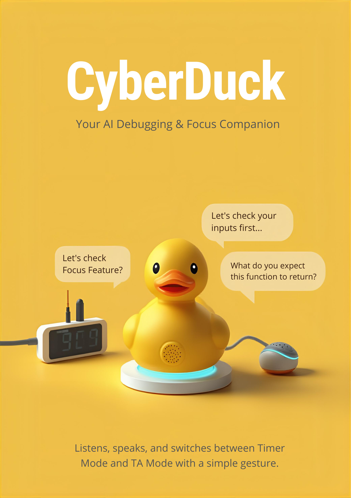
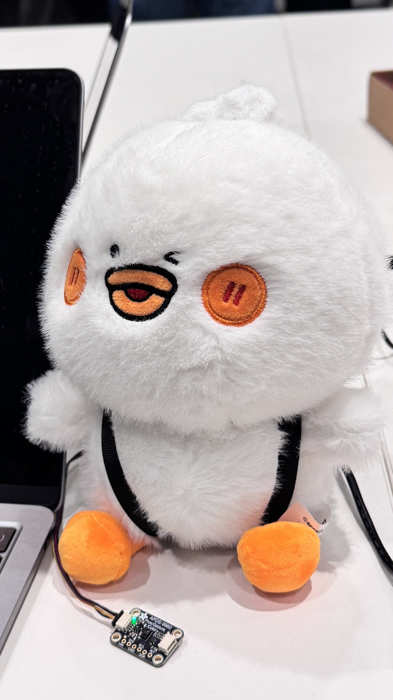
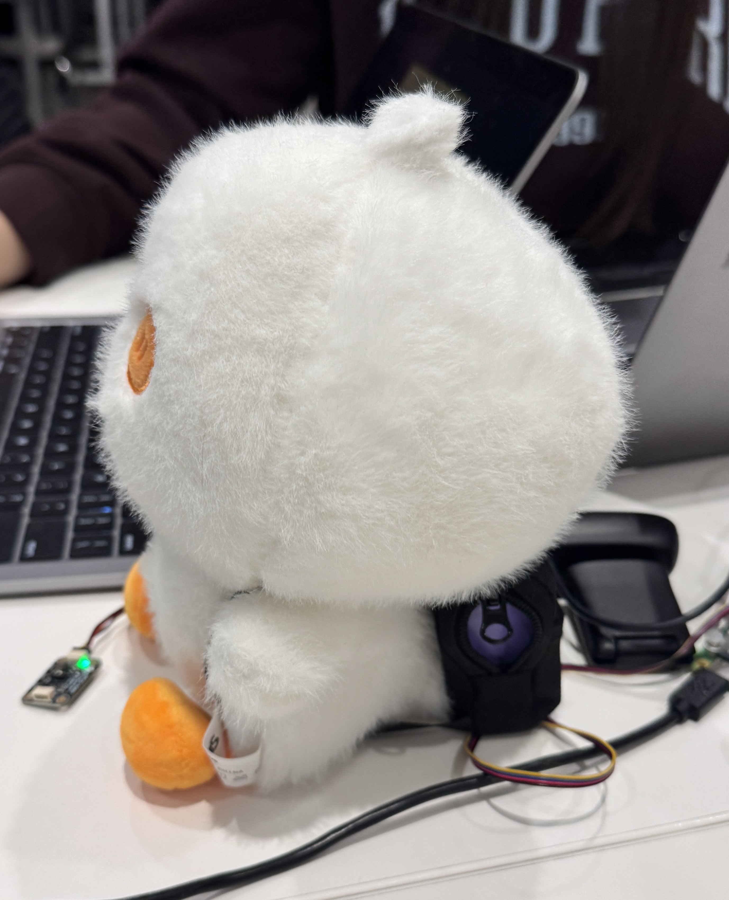
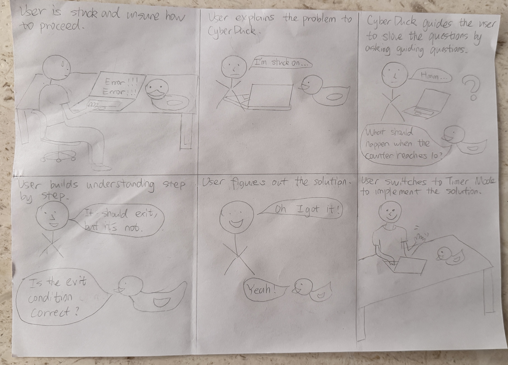
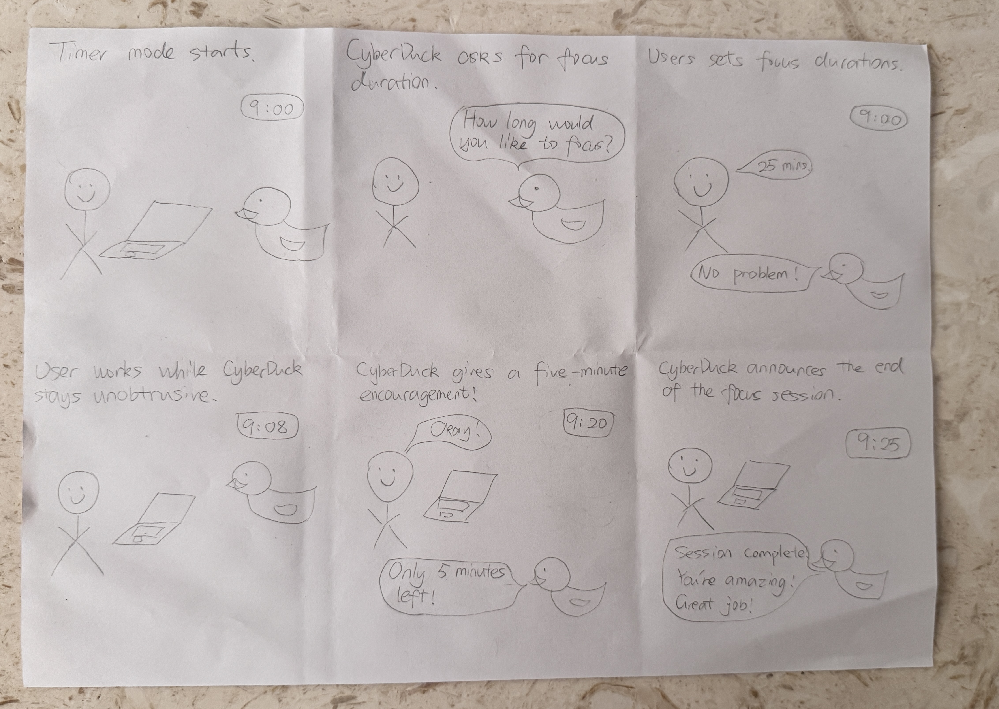
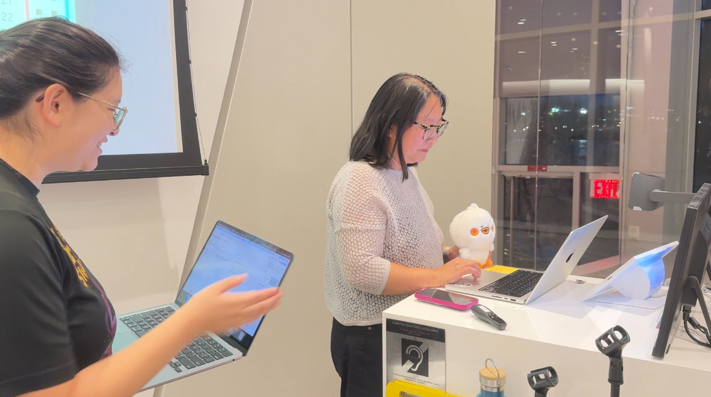
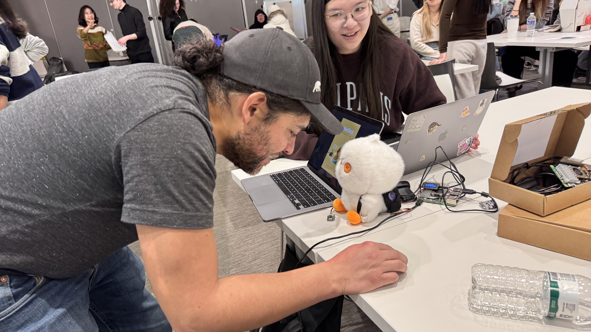
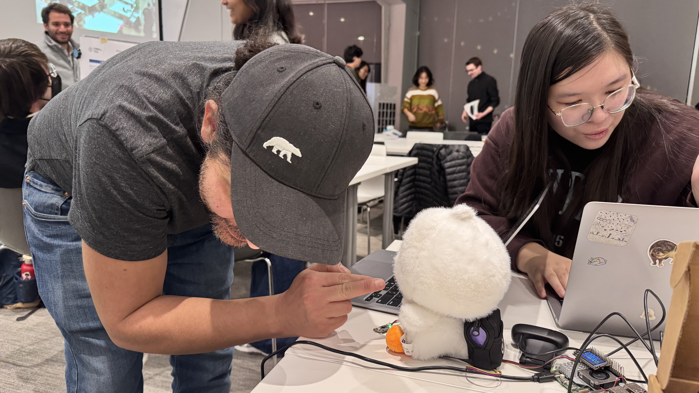

# Final Project

[Project Plan](#project-plan) 

[Functioning Project](#functioning-project) 

[Documentation of Design Process](#documentation-of-design-process) 

[Archive of All Code and Design Patterns](#archive-of-all-code-and-design-patterns) 

[Video Demo](#video-demo) 

[Reflections on Process](#reflections-on-process) 

[Group Work Distribution](#group-work-distribution) 

## Project Plan

This project is done by Yannis Zhu & Amy Chen.

### Big Idea

CyberDuck is an AI-powered desk companion designed to support people during focused work and problem-solving through two complementary interaction modes: Timer Mode and TA Mode. While both modes aim to help users work more effectively, they address fundamentally different cognitive needs and are therefore not interchangeable.

Timer Mode is most effective when users already know what they want to work on but struggle with focus, motivation, or time awareness. In this mode, CyberDuck structures work into focused sessions, provides gentle audio cues, and offers light emotional encouragement. The goal is to support sustained attention without interrupting the user’s thinking. In these situations, giving advice or solutions would be distracting rather than helpful.

TA Mode, by contrast, is designed for moments of cognitive blockage, such as debugging code or reasoning through a difficult problem. Instead of behaving like a traditional chatbot that quickly provides answers, TA Mode is intentionally pedagogical. CyberDuck guides users through their own reasoning process by asking leading questions, breaking problems into smaller steps, and encouraging reflection. This design emphasizes learning and understanding over efficiency, making it especially suitable for educational or skill-building contexts.

These two modes serve different purposes and are most valuable at different moments in a user’s workflow. A timer alone cannot help a user reason through a logic bug, just as an intelligent tutor may interrupt deep focus when the user simply needs uninterrupted work time. By combining both modes into a single, embodied device, and allowing users to switch between them using simple physical gestures, CyberDuck adapts to changing cognitive needs throughout the day while keeping the interaction lightweight, playful, and intuitive.

###  Timeline
11/10: Finish & submit project plan

11/11 – 11/14: Design iterations
- Storyboarding
- Dialogue design
- Wizard device to get user opinions (what’s a good voice + additional features)

11/15 – 11/20: Implement the design (device only)
- Raspberry Pi setup and configuration
- Implement STT → LLM → TTS pipeline
- Gesture sensor integration and mode switching logic
- Initial audio output and timing calibration

11/21 – 11/23: Module Testing
- Test each module separately
- Refine voice + timing

11/24 – 11/25: System Integration
- Combine gesture switching with conversation engine

11/26 – 11/31: Implement the design (physical build)
- Create the Cyberduck body
- Integrate Raspberry Pi, microphone, speaker, and sensors
- Finalize physical form and wiring

12/1: Functional check-off
- Present working prototype to teaching team
- Demonstrate Timer Mode and TA Mode switching

12/2 – 12/7: User testing & documentation
- Test with sample users
- Collect feedback on intuitiveness, latency, and clarity
- Record demo video and prepare presentation materials

12/8: Final project presentation
- Present CyberDuck to the class

12/9 – 12/15: Reflection & final write-up
- Summarize design process and user feedback
- Reflect on trade-offs, limitations, and future improvements
- Submit final documentationion

### Parts Needed

Raspberry Pi 4 – main computing unit

Plush duck enclosure – physical embodiment of CyberDuck and housing for the system

USB microphone – speech input for user interaction

Mini speaker – audio output for feedback and responses

APDS-9960 gesture sensor – physical gesture detection for mode switching

Fast LLM model and improved TTS – to reduce latency and improve conversational quality

### Fallback Plan

Given the complexity of real-time speech and gesture interaction, several fallback strategies are planned to ensure robustness:

- If LLM response latency becomes too high, CyberDuck will switch to pre-scripted prompts for common encouragements or guiding questions.

- If real-time generation is unreliable, speech-to-text results can be used to trigger predefined responses rather than full conversational output.

- If the gesture sensor proves unreliable, it can be replaced with a simple physical button for mode switching while preserving the core interaction logic.

These fallback options ensure that even if advanced components fail, the core user experience of mode switching and supportive interaction remains functional and testable.

## Functioning Project

## Documentation of Design Process

### Storyboards

#### TA Mode: 

#### Timer Mode: 

### Wizard 

1. Wizarding with Wendy
   

During the session with Wendy, one of the most prominent observations was that most people work silently during focused tasks. This made it difficult to determine when CyberDuck should interject, since there were few explicit cues indicating whether the user wanted interaction or uninterrupted focus.

Wendy suggested that CyberDuck could adopt a Pomodoro-like structure, where the duck announces when a focus session ends, asks what the user has accomplished, and offers brief positive reinforcement. This approach would allow CyberDuck to support users without requiring continuous conversational engagement. Wendy also commented on the voice, suggesting that it could be more “duck-like”, reinforcing the playful, companion-based nature of the device.

2. Wizarding with Jade Change(Interactive Device Classmate)

Jade found the interaction meaningful and potentially useful, noting that the cuteness of the duck made the experience more engaging and approachable. However, she felt that the chosen voice (Zephyr; one of the Gemini AI voices) was too high-pitched and hyper, which could become distracting during extended use.

Jade also suggested the need for a clear wake-up line to signal when CyberDuck is actively listening, rather than always passively monitoring the environment. In the context of TA Mode, she wondered whether CyberDuck could have more contextual awareness, such as knowing what is on the user’s screen, to better support debugging or problem-solving.

3. Wizarding with Jiayi Wu (UX Designer)

Jiayi raised several deeper concerns around conversational AI and cognitive flow. She emphasized the importance of customization, noting that not all users would want to interact with a duck persona or a playful voice. In fact, she felt that a duck voice could feel awkward or unnatural in serious work contexts.

Jiayi also stressed the need for explicit instructions about when CyberDuck is listening. She expressed discomfort with the idea of the duck listening at all times and strongly supported the idea of a wake-up line or deliberate activation mechanism. More broadly, she pointed out that conversation with AI can feel unnatural, especially because human conversation naturally involves interruptions, pauses, and overlapping speech.

Importantly, Jiayi noted that talking through ideas aloud is often part of her personal thinking process, and an AI responding at the wrong moment could actually pull her out of that flow. In some cases, she may want to verbalize thoughts without receiving any response at all, which is similar to the original idea of “rubber duck debugging.”

#### Key Takeaways & Design Implications

Across all three Wizard-of-Oz sessions, a consistent theme emerged: timing matters more than intelligence. While users appreciated the idea of an embodied AI companion, unsolicited or poorly timed interruptions risk breaking focus and feeling unnatural.

These findings directly informed several design decisions:

- Adopting Timer Mode as a structured, predictable interaction pattern

- Introducing a wake-up line to clearly signal when CyberDuck is listening

- Avoiding constant conversational engagement in favor of intentional, mode-based interaction

- Treating silence and non-response as valid and sometimes preferable system behaviors

- Considering voice customization and personality flexibility for different users

Overall, the Wizard-of-Oz study helped shift CyberDuck from a conversational AI that always responds toward a companion that is selectively present, supporting users without demanding attention.

### Building Functionality

#### Physical Construction

For the physical embodiment of CyberDuck, we were fortunate to find a plush duck toy whose size, proportions, and visual character closely matched our envisioned product. The softness and familiarity of the plush material helped reinforce CyberDuck’s role as a friendly desk companion rather than a piece of technical equipment.

Initially, we considered opening the plush duck and embedding a mini speaker inside the body. However, after further consideration, we realized that the battery life and maintenance of an internally embedded speaker could become problematic, especially during longer work sessions. To avoid frequent disassembly or charging difficulties, we instead designed a small external pouch that CyberDuck “wears” like a backpack. The mini speaker is placed inside this pouch, allowing easy access for charging or replacement while preserving the integrity of the duck body. This solution balanced practicality with the playful character of the object, and it visually reinforced CyberDuck as an active, mobile companion.

#### Early Software Prototypes

On the software side, development began with two largely independent prototypes corresponding to the two interaction modes.

The initial TA Mode, built by Amy, relied on a slower, native large language model with relatively poor text-to-speech quality. While the core idea of conversational assistance was present, the latency and robotic audio output made interactions feel sluggish and unnatural, especially during problem-solving scenarios.

In parallel, I built the first version of Timer Mode, which relied entirely on pre-recorded audio. These audio clips used a Gemini-generated voice, and based on feedback from Wizard-of-Oz testing, I selected the “Sulafat” voice, which is warm and mid-pitched. To further enhance the playful tone, I added a soft quack sound as an auditory signature to make interactions feel lighter and more engaging.

However, the flow of this early Timer Mode was intentionally simple. It consisted of:

- A greeting announcing the start of the session

- A silent focus period

- A announcement when five minutes remained, paired with encouragement

- A announcement marking the end of the session and encouraging future focus

While this version established the basic rhythm of Timer Mode, it lacked interactivity and personalization.

#### Feedback from Functional Check-off

After presenting this version during the functionality check, we received several important pieces of feedback from the teaching team:

- TA Mode should move to a faster language model with improved text-to-speech, potentially using an API-based approach to reduce latency and improve conversational quality.

- Timer Mode could benefit from richer interaction, such as incorporating contextual sensing (e.g., phone detection or mug detection) to make the experience more responsive and playful. For example, detecting phone usage could trigger a gentle reminder to refocus, while detecting a coffee mug could prompt a lighthearted comment encouraging productivity.

This feedback motivated a significant refinement of both modes.

#### Refined TA Mode

In the later version, the TA Mode was redesigned to prioritize responsiveness and guided reasoning. It now uses the Gemini API to answer user questions, with the key design constraint that the assistant should walk the user through a problem rather than simply provide solutions. To support this, the system sends the full conversational context with each request, allowing the model to remember what the user has previously said and maintain continuity across turns. Conceptually, this makes TA Mode feel closer to a thoughtful tutor than a search engine.

#### Expanded Timer Mode

The expanded Timer Mode introduces a set of newly added features designed to create a more engaging and supportive focus experience. At the start of each session, the system asks users what they plan to focus on and prompts them to select a short, medium, or long work period. Before the timer begins, users are guided through a brief breathing exercise to help them transition into a focused state. During the session, the system provides mid-session encouragement and retains the five-minute reminder from the initial prototype. If speech is detected while the user is meant to be focusing, the system gently checks in by asking, “Are you still with me? Say yes.” The session concludes with a clear end-of-session announcement that acknowledges the user’s effort and encourages future focus. All of these interactions are supported by more carefully designed audio cues that are intentionally brief, calm, and predictable.

A key enhancement in this iteration is the introduction of user voice input, which makes the timer more interactive. Speech recognition is used to capture short user responses, such as stating a task or confirming presence, and these inputs are treated as lightweight signals rather than conversational turns. 

Together, these additions reflect a deliberate effort to improve the overall user experience of Timer Mode. By combining structure, gentle interaction, and user agency, the timer evolves from a static countdown tool into a guided focus experience that supports motivation while respecting the user’s attention.

#### Gesture-Based Mode Switching

We developed a gesture-based mode switching feature that allows users to switch between Timer Mode and TA Mode using simple hand gestures. By using a gesture sensor, users can change modes without speaking commands or touching the device. This design reinforces CyberDuck’s role as an embodied, ambient companion. An upward gesture activates Timer Mode, while a downward gesture switches to TA Mode, with brief audio feedback confirming the change.

#### User Testing

We used the Final Project Presentation as an opportunity to conduct informal user testing with our prototype. During the presentation session, around ten users interacted with CyberDuck and explored its core features. However, because multiple groups were presenting in the same room simultaneously, the environment was noisy and highly dynamic, which made both user voice input and hearing CyberDuck’s audio output challenging. As a result, users were only able to test gesture-based mode switching and Timer Mode, while extended verbal interaction in TA Mode was limited.

Despite these constraints, users responded positively to several aspects of the system. Many participants found the breathing exercise at the start of Timer Mode to be engaging and calming, noting that it helped signal a clear transition into focused work. Users also expressed strong interest in the overall concept and physical appearance of CyberDuck, describing it as approachable, playful, and well-suited for a desk companion. Even without fully testing voice-based interaction, participants were able to understand the intended behaviors of the system and how the two modes support different working needs.

Below is a photo of a participant talking to CyberDuck, demonstrating voice-based interaction:

Below is a photo of a participant testing CyberDuck’s gesture-based mode switching feature.:

#### Additional Feature

Building on insights from user testing, I introduced several additional features and refinements to Timer Mode to better support sustained focus, reduce ambiguity in voice-only interactions, and encourage post-session reflection. 

I added a phone detection feature built on a lightweight computer vision model trained with Teachable Machine and deployed using TensorFlow Lite. The system continuously monitors the camera feed during the focus session and estimates the probability that a phone is present in the frame. To avoid false positives and unnecessary interruptions, the system only triggers a reminder if the phone is detected continuously above a confidence threshold (0.85) for five seconds. When this condition is met, CyberDuck gently reminds the user to refocus. This design treats phone presence as a sustained distraction signal rather than a momentary glance, aligning with the goal of minimizing disruption while still promoting mindful focus.

Moreover, at the end of the focus session, the system prompts the user to verbally recap what they worked on and what they accomplished during the session. Rather than evaluating or parsing the content of the response, CyberDuck simply listens and provides an acknowledgment. This feature is designed to encourage reflection and closure, helping users consolidate their effort and reinforcing a sense of progress, even for short focus sessions.

I also refined the audio feedback for session selection to explicitly communicate the duration of each session. Instead of simply confirming “short,” “medium,” or “long,” CyberDuck now clearly states how long the selected session will last (e.g., “We’ll focus for 45 minutes”). This change improves transparency and reduces ambiguity in a voice-only interface, helping users better understand and commit to the selected focus duration before the session begins.

Finally, to reduce the disruptive impact of spoken interruptions during the focus session, I intentionally introduced a soft, non-verbal notice sound that plays immediately before any message audio. This brief auditory cue acts as a gentle transition, signaling that CyberDuck is about to speak without startling the user or abruptly breaking concentration. By separating attention-shifting moments from the spoken content itself, this design helps users reorient smoothly while preserving the calm and predictable rhythm of the focus session. This approach was informed by user testing and aligns with the broader goal of making system interventions supportive rather than intrusive.

## Archive of All Code and Design Patterns

#### Please view my source code [here]()

## Video Demo

## Reflections on Process

First and foremost, I am very glad that we had the initial idea pitch presentation. The most important advice I learned from Wendy was to conduct Wizard-of-Oz testing early rather than leaving user testing until the end. Originally, we planned to build core features first and test them later. Wendy pointed out that this mindset is risky, because without early testing, we might spend significant time building something that does not work well in practice. By using Wizard-of-Oz methods before full implementation, we were able to understand what users actually needed and how they responded to the interaction. This helped us avoid wasted effort and guided our design decisions more effectively. This lesson fundamentally changed how I think about the relationship between prototyping and user testing.

Through building and testing CyberDuck, I developed a deeper understanding of the limitations of voice-based interaction, especially in the context of supporting focus. While voice interfaces can feel natural and engaging, they are also fragile and highly sensitive to timing, environment, and user attention. Speech recognition errors, background noise, and latency can quickly disrupt the user experience or break immersion. Additionally, spoken feedback inherently demands attention, making it easy for voice interactions to become intrusive if not carefully designed. These constraints led us to treat voice input as a lightweight signal rather than a primary communication channel and to keep spoken output brief, predictable, and intentionally paced. This reflection reinforced the importance of designing voice interfaces with clear boundaries and fallback behaviors, particularly in systems meant to reduce distraction rather than create it.

I also learned that while ambition can be motivating, it can easily lead to projects that are too large or complex, especially for small teams. When a project becomes overwhelming, it is easy to get stuck or lose direction. Starting with a small, simple core and gradually building on top of it is often more effective. I think we handled this balance well by scoping CyberDuck into two main modes and beginning with a very basic initial version using a native LLM and slower text-to-speech. From there, we iteratively improved performance and interaction quality. This approach allowed us to make steady progress while keeping the project manageable.

Another important takeaway was the value of iterative development. Rather than trying to design a “perfect” system upfront, we continuously refined CyberDuck based on testing, technical constraints, and usability considerations. Each iteration helped us clarify what features truly mattered to the user and which ones could be simplified or removed. This process made the final system more focused and coherent, and it helped us make informed trade-offs between functionality and reliability.

Finally, working in a small team teaches me the importance of clear communication and task division. Because we only had two people, we needed to be intentional about how we split responsibilities while still making major design decisions together. Regular check-ins and shared discussions helped ensure that technical implementation and interaction design stayed aligned. This collaboration style made it easier to move quickly while maintaining a consistent vision for the project.

## Group Work Distribution

I took primary ownership of Timer Mode, including designing the interaction flow, implementing the timing logic, voice prompts, and overall behavior during focus sessions. I also created the storyboards and produced the draft version of the final report, as well as leading much of the documentation and Wizard-of-Oz evaluations that informed key design decisions.

Amy took primary ownership of TA Mode, focusing on the learning- and reasoning-oriented interaction design. She also implemented the mode-switching mechanism, ensuring smooth transitions between Timer Mode and TA Mode, and shaped how the system responds during problem-solving interactions.

Despite this division of responsibility, all core design decisions were made collaboratively. We regularly shared ideas, discussed trade-offs, and supported each other’s work to ensure a cohesive overall design. While I prepared the initial draft of the final report, we ultimately each wrote and submitted our own final report, reflecting both individual contributions and the shared design process.

## Notes on AI Assistant
For this lab, I used ChatGPT to help me summarize my design decisions and rewrite some sections into clearer paragraphs. All reflection points and design choices are my own. Also, some of my script was coded using the assistance of ChatGPT.
