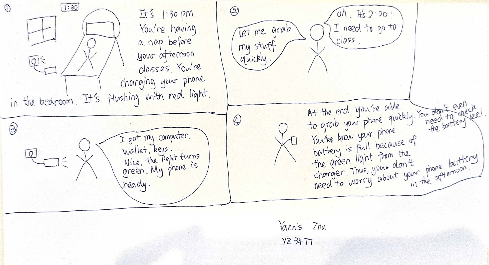
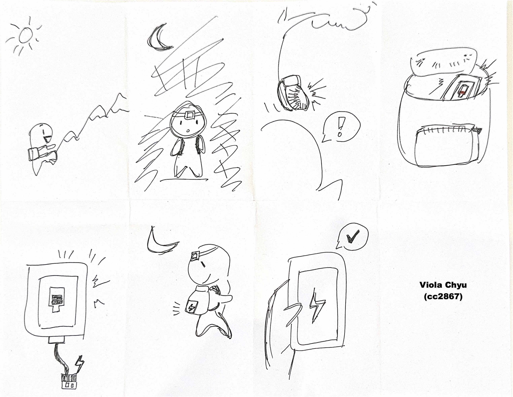
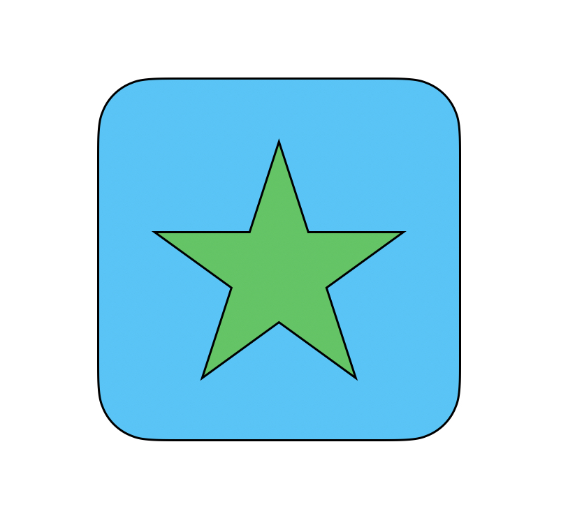
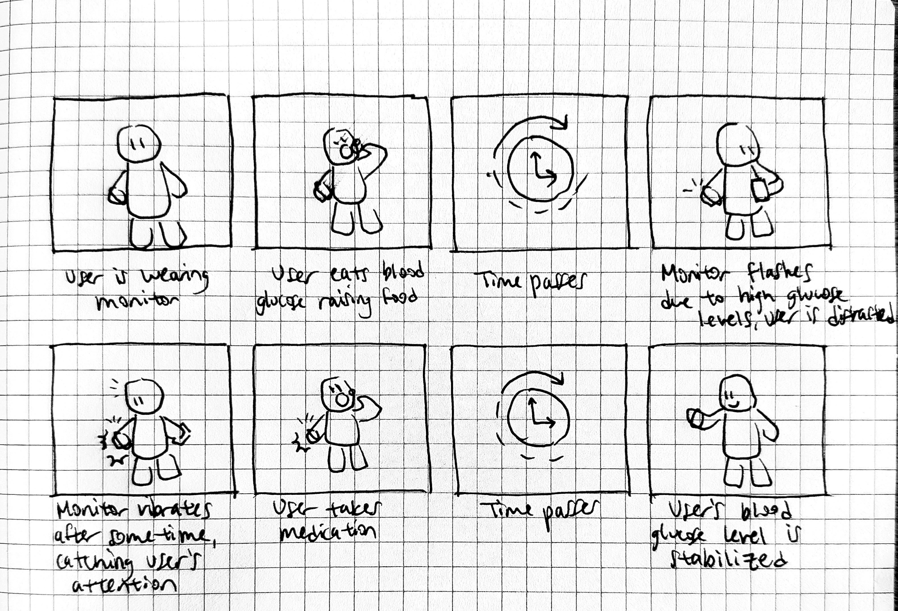
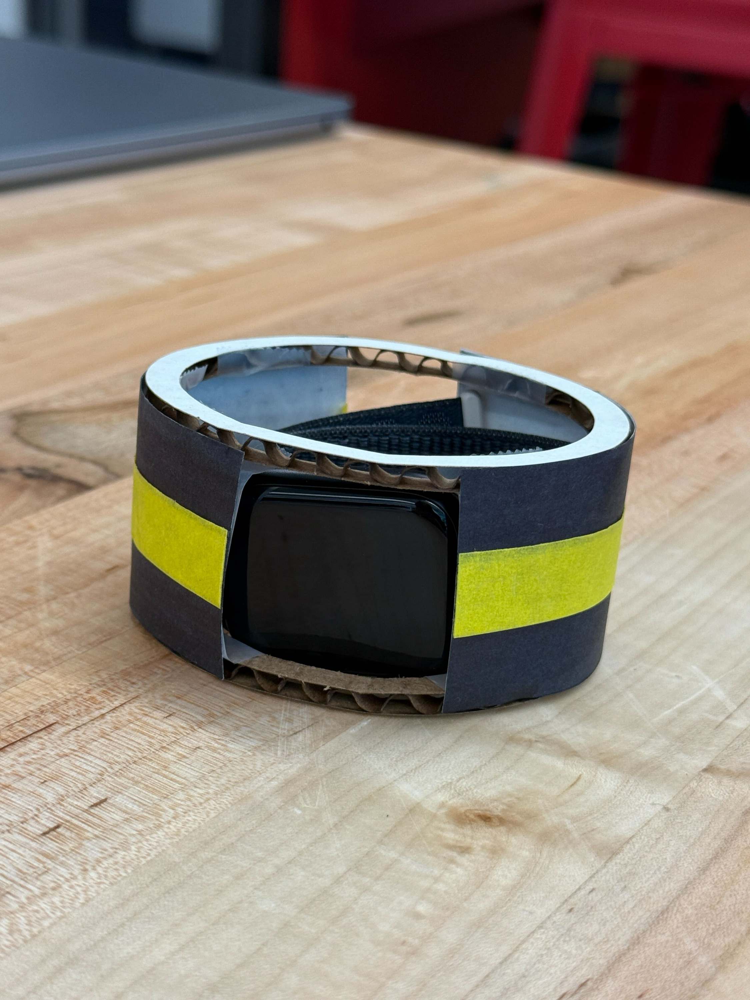
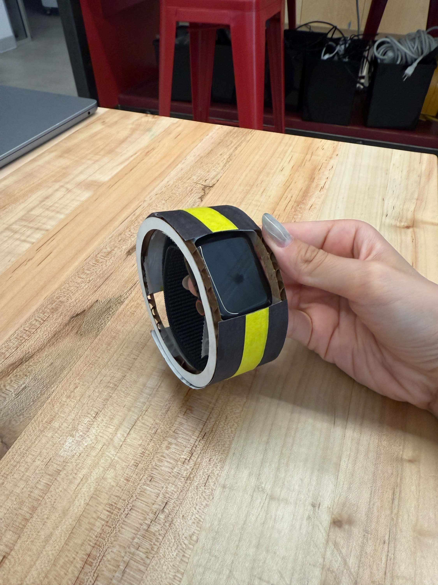
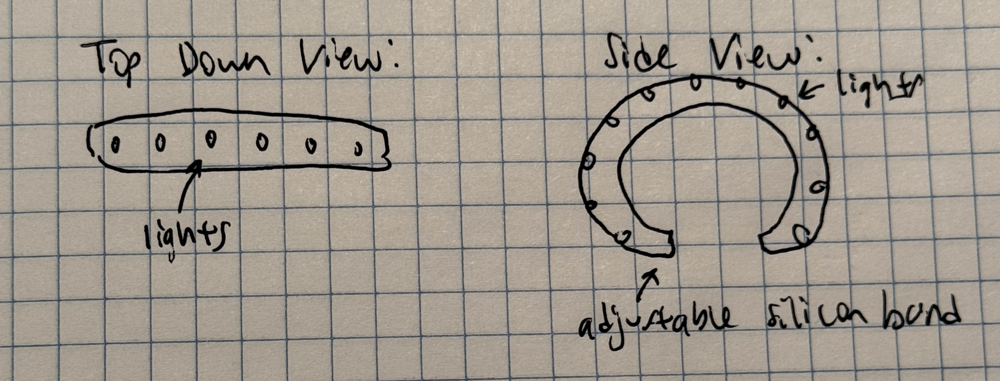

# Staging Interaction

In the original stage production of Peter Pan, Tinker Bell was represented by a darting light created by a small handheld mirror off-stage, reflecting a little circle of light from a powerful lamp. Tinkerbell communicates her presence through this light to the other characters. See more info [here](https://en.wikipedia.org/wiki/Tinker_Bell). 

There is no actor that plays Tinkerbell--her existence in the play comes from the interactions that the other characters have with her.

For lab this week, we draw on this and other inspirations from theatre to stage interactions with a device where the main mode of display/output for the interactive device you are designing is lighting. You will plot the interaction with a storyboard, and use your computer and a smartphone to experiment with what the interactions will look and feel like. 

_Make sure you read all the instructions and understand the whole of the laboratory activity before starting!_

## Prep

### To start the semester, you will need:
1. Read about Git [here](https://git-scm.com/book/en/v2/Getting-Started-What-is-Git%3F).
2. Set up your own Github "Lab Hub" repository by forking the [Interactive-Lab-Hub repository](https://github.com/FAR-Lab/Interactive-Lab-Hub). To get lab updates, simply [use GitHub's "Sync fork" button when new content is available](https://docs.github.com/en/pull-requests/collaborating-with-pull-requests/working-with-forks/syncing-a-fork).

3. Set up the README.md for your Hub repository (for instance, so that it has your name and points to your own Lab 1). You can [learn how to organize and format your README.md here](https://docs.github.com/en/get-started/writing-on-github/getting-started-with-writing-and-formatting-on-github/basic-writing-and-formatting-syntax). Make sure to include links to your submissions so they are easy to find.

### For this lab, you will need:
1. Paper
2. Markers/ Pens
3. Scissors
4. Smart Phone -- The main required feature is that the phone needs to have a browser and display a webpage.
5. Computer -- We will use your computer to host a webpage which also features controls.
6. Found objects and materials -- You will have to costume your phone so that it looks like some other devices. These materials can include doll clothes, a paper lantern, a bottle, human clothes, a pillow case, etc. Be creative!

### Deliverables for this lab are: 
1. 7 Storyboards
1. 3 Sketches/photos of costumed devices
1. Any reflections you have on the process
1. Video sketch of 3 prototyped interactions
1. Submit the items above in the lab1 folder of your class [Github page], either as links or uploaded files. Each group member should post their own copy of the work to their own Lab Hub, even if some of the work is the same from each person in the group.

### The Report
This README.md page in your own repository should be edited to include the work you have done (the deliverables mentioned above). Following the format below, you can delete everything but the headers and the sections between the **stars**. Write the answers to the questions under the starred sentences. Include any material that explains what you did in this lab hub folder, and link it in your README.md for the lab.

## Lab Overview
For this assignment, you are going to:

A) [Plan](#part-a-plan) 

B) [Act out the interaction](#part-b-act-out-the-interaction) 

C) [Prototype the device](#part-c-prototype-the-device)

D) [Wizard the device](#part-d-wizard-the-device) 

E) [Costume the device](#part-e-costume-the-device)

F) [Record the interaction](#part-f-record)

Labs are due on Mondays. Make sure this page is linked to on your main class hub page.

## Part A. Plan 

To stage an interaction with your interactive device, think about:

_Setting:_ Where is this interaction happening? (e.g., a jungle, the kitchen) When is it happening?

_Players:_ Who is involved in the interaction? Who else is there? If you reflect on the design of current day interactive devices like the Amazon Alexa, it’s clear they didn’t take into account people who had roommates, or the presence of children. Think through all the people who are in the setting.

_Activity:_ What is happening between the actors?

_Goals:_ What are the goals of each player? (e.g., jumping to a tree, opening the fridge). 

The interactive device can be anything *except* a computer, a tablet computer or a smart phone, but the main way it interacts needs to be using light.

\*\***Describe your setting, players, activity and goals here.**\*\*

- **Portable Smart Charger:** This device is designed to make checking your phone’s charging status simple and intuitive. It uses a clear light system: red indicates the device is charging, and green shows it’s fully charged. By glancing at the charger, the user can instantly know whether their device is ready without unlocking the screen or checking battery levels. Its portable design means it can fit naturally into different daily routines, offering convenience and reassurance wherever charging happens.

Storyboards are a tool for visually exploring a users interaction with a device. They are a fast and cheap method to understand user flow, and iterate on a design before attempting to build on it. Take some time to read through this explanation of [storyboarding in UX design](https://www.smashingmagazine.com/2017/10/storyboarding-ux-design/). Sketch seven storyboards of the interactions you are planning. **It does not need to be perfect**, but must get across the behavior of the interactive device and the other characters in the scene. 

\*\***Include pictures of your storyboards here**\*\*

Present your ideas to the other people in your breakout room (or in small groups). You can just get feedback from one another or you can work together on the other parts of the lab.

\*\***Summarize feedback you got here.**\*\*
Overall, feedback was that the concept solves a real pain point and the storyboard effectively showed a realistic, portable use case.
- The red/green light system is clear and intuitive, so users don’t need to constantly check their phone screen. 
- **Visibility** concern: if the charger is hidden (e.g., under a desk), the light might be hard to see. Brightness or an extra notification could help.  
- **Accessibility**: red/green color-blind users might not distinguish the lights easily. Consider blinking, dual colors, or icons.  
- **Energy efficiency**: if the light stays on after charging, it may waste power. An auto shutoff could be useful.  
- Overall, feedback was that the concept solves real pain points (knowing charge status at a glance and also being portable is very useful) and the storyboard clearly showed a realistic use case.  

## Part B. Act out the Interaction

Try physically acting out the interaction you planned. For now, you can just pretend the device is doing the things you’ve scripted for it. 

\*\***Are there things that seemed better on paper than acted out?**\*\*
- On paper, the light felt like a strong and clear signal, but when acting it out we realized that visibility depends heavily on where the charger is placed.
- It also seemed less convenient to rely only on the red/green light.   

\*\***Are there new ideas that occur to you or your collaborator that come up from the acting?**\*\*
- Add **different brightness levels or a blinking pattern** to make the signal more noticeable at a glance.  
- Consider a **sound or vibration cue** once the device is fully charged.  
- Provide an alternative indicator for **color-blind users** (e.g., icon, shape, or brightness change).  
- Have the light **shut off automatically** after a few minutes of being green to save energy and avoid nighttime distraction.  

## Part C. Prototype the device

You will be using your smartphone as a stand-in for the device you are prototyping. You will use the browser of your smart phone to act as a “light” and use a remote control interface to remotely change the light on that device. 

Code for the "Tinkerbelle" tool, and instructions for setting up the server and your phone are [here](https://github.com/IRL-CT/tinkerbelle).

We invented this tool for this lab! 

If you run into technical issues with this tool, you can also use a light switch, dimmer, etc. that you can can manually or remotely control.

\*\***Give us feedback on Tinkerbelle.**\*\*
Tinkerbelle was easy to set up, but having more detailed explanations would help with understanding.

## Part D. Wizard the device
Take a little time to set up the wizarding set-up that allows for someone to remotely control the device while someone acts with it. Hint: You can use Zoom to record videos, and you can pin someone’s video feed if that is the scene which you want to record. 

\*\***Include your first attempts at recording the set-up video here.**\*\*

[Watch the demo video](https://drive.google.com/file/d/FILE_ID/view?usp=sharing)

Now, change the goal within the same setting, and update the interaction with the paper prototype. 

\*\***Show the follow-up work here.**\*\*

[Watch the demo video](https://drive.google.com/file/d/1nfMfFijP1ivAtzLnNU7PNlpAIlMq7mIL/view?usp=drive_link)

## Part E. Costume the device

Only now should you start worrying about what the device should look like. Develop three costumes so that you can use your phone as this device.

Think about the setting of the device: is the environment a place where the device could overheat? Is water a danger? Does it need to have bright colors in an emergency setting?

\*\***Include sketches of what your devices might look like here.**\*\*

\*\***What concerns or opportunitities are influencing the way you've designed the device to look?**\*\*

For the portable power brick design, the main concern is portability and convenience. The rounded, compact shape makes it easy to slip into a backpack or bag without taking much space. A prominent LED star shape ensures that the charging status is visible even on the go, so the user can quickly check whether the device is charging or fully charged. 

## Part F. Record

\*\***Take a video of your prototyped interaction.**\*\*

\*\***Please indicate who you collaborated with on this Lab.**\*\*
Be generous in acknowledging their contributions! And also recognizing any other influences (e.g. from YouTube, Github, Twitter) that informed your design. 

# Staging Interaction, Part 2 

This describes the second week's work for this lab activity.

## Prep (to be done before Lab on Wednesday)

You will be assigned three partners from other groups. Go to their github pages, view their videos, and provide them with reactions, suggestions & feedback: explain to them what you saw happening in their video. Guess the scene and the goals of the character. Ask them about anything that wasn’t clear. 

\*\***Summarize feedback from your partners here.**\*\*
Alice Zhang az536

## Make it your own

Do last week’s assignment again, but this time: 
1) It doesn’t have to (just) use light, 
2) You can use any modality (e.g., vibration, sound) to prototype the behaviors! Again, be creative! Feel free to fork and modify the tinkerbell code! 
3) We will be grading with an emphasis on creativity. 

\*\***Document everything here. (Particularly, we would like to see the storyboard and video, although photos of the prototype are also great.)**\*\*

## Part A. Plan 
Since my lab parnters from Part 1 had dropped this class, I decided to work with Alice Zhang on her idea of ***Visual Glucose Monitor***.

\*\***Describe your setting, players, activity and goals here.**\*\*

***Visual Glucose Monitor***: This device is designed to be used throughout everyday activities. The main user is wearing the glucose monitor. Other players nearby might also notice alerts but will not impact light functionality. The main user wears the monitor. If the user’s glucose levels rise above the safe threshold, the device flashes to alert the user and those nearby. Once the user’s levels return to normal, the light turns off. The goal is to provide real-time alerts of harmful blood sugar levels.

\*\***Include pictures of your storyboards here**\*\*

Original storyboard:

On the second iteration of this prototype, we focused on adapting the device for situations where the user may not immediately notice the visual flashing alert. The updated storyboard reflects this use case.

We modified the functionality so that if glucose levels remain high after a set period, the device issues a secondary vibration and sound alert. This ensures the user is prompted to take action even if they overlook the visual signal.

In response to prior feedback about privacy concerns, the device should have a configurable option to disable either sound or light alerts to preserve discretion if desired. The updated vibration is a key feature would provide a more immediate way of capturing the user’s attention.

Other physical design changes include replacing individual LEDs with a continuous LED band across the bracelet, improving visibility of the visual alert. Prototype photos demonstrating this updates are shown below.

Updated Storyboard:

\*\***Summarize feedback you got here.**\*\*
Some critiques included concerns over for user privacy as well as suggestions for lighting features for additional information displayed.

\*\***Are there things that seemed better on paper than acted out?**\*\*
The wristband alert may not be as visible in certain hand positions.

\*\***Are there new ideas that occur to you or your collaborator that come up from the acting?**\*\*
Due to the consideration above, the design idea changed from an envisioned row of lights just on the top of the wristband to a ring of lights around the entire band.

\*\***Include your first attempts at recording the set-up video here.**\*\*

\*\***Include sketches of what your devices might look like here.**\*\*

\*\***What concerns or opportunitities are influencing the way you've designed the device to look?**\*\*
Visibility concern: Replaced small LEDs with a continuous LED band for clearer, more noticeable alerts.

Privacy concern: Added options to disable sound or light so the device can remain discreet.

Opportunity for balance: Design now looks sleeker and more modern while offering both high visibility and subtle use when needed.

\*\***Take a video of your prototyped interaction.**\*\*

A window was added to the prototype to allow an Apple Watch screen to simulate the flashing mechanism for video purposes.
