# Interactive Prototyping: The Clock of Pi

# Lab 2 Part 1

Yannis Zhu yz3477 

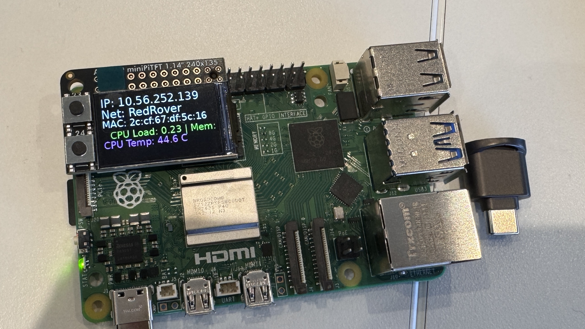

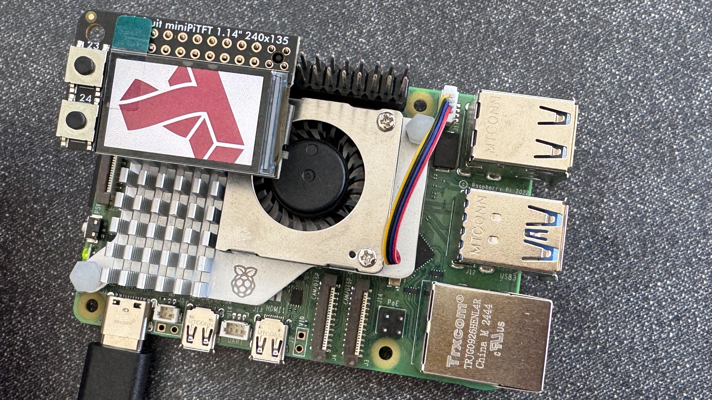

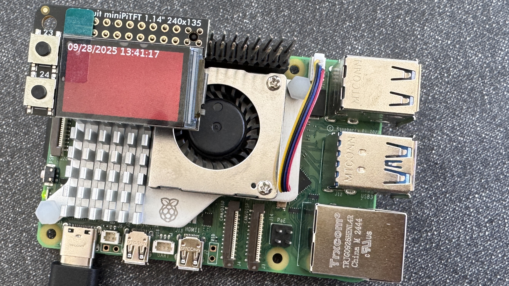

[Testing buttons](https://drive.google.com/file/d/1jSqCLsxJ_tglY7RoPkeRqU4lAqIU-INb/view?usp=sharing)

## Sketch and brainstorm further interactions and features you would like for your clock for Part 2.

***Introduction***:
I want to reimagine time as a cyclical, body-based rhythm rather than a strictly linear measure. For many women and people who menstruate, time is already experienced this way — not only in weeks or months, but in recurring physical and emotional patterns shaped by the menstrual cycle. With this in mind, my goal for this project is to build a ***“Period Clock”***, a physical interface that helps users understand and track the phases of their cycle in a gentle, intuitive, and empowering way. This design aims to support self-awareness, encourage planning around one’s natural fluctuations in energy and mood, and make visible the cyclical nature of menstruation as it is lived and felt.

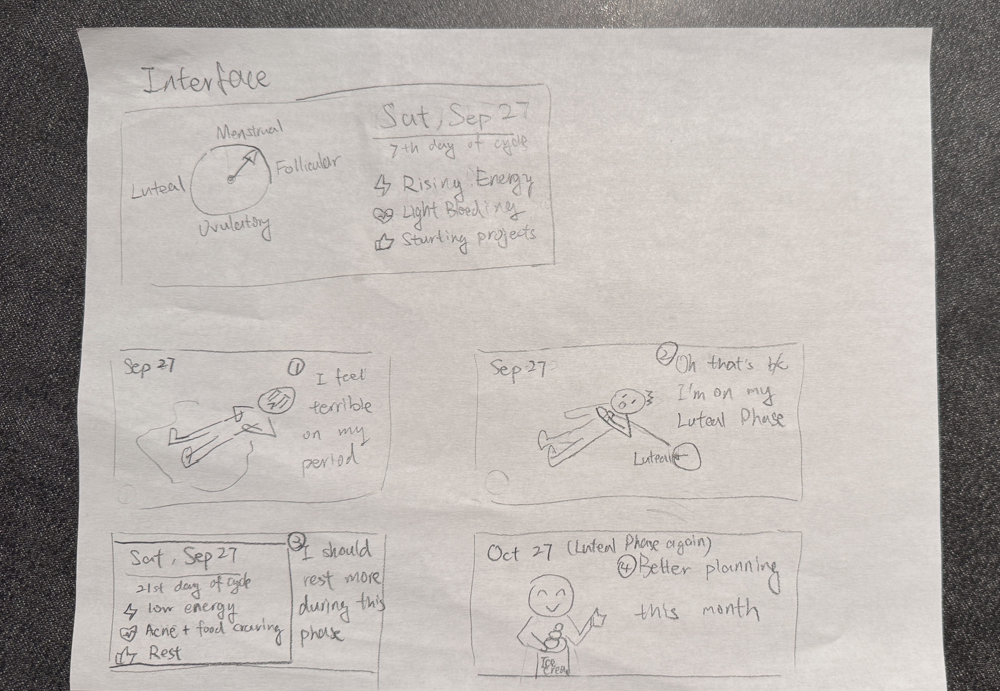 

***Interface Design***:
Our Period Clock uses a circular display to represent the menstrual cycle, divided into ***four phases: Menstrual, Follicular, Ovulatory, and Luteal***. A pointer shows the user’s current position in the cycle, making it easy to see where they are and what phase comes next. Alongside the diagram, the interface presents today’s date, the day of the cycle, a short phrase describing energy or mood, symptom reminders, and a suggested action such as “Start new projects” or “Rest more.” This design turns abstract cycle data into an intuitive, everyday reference.

***Storyboard***:
The storyboard shows one example of how the Period Clock helps users connect daily experiences to their cycle. At first, the user feels terrible during their period. Later, the clock explains they are in the Luteal phase, helping them understand low energy and cravings. The interface suggests rest, and the user realizes they should care for themselves more during this time. A month later, the user feels prepared and reflects, “better planning this month,” showing how the clock builds awareness and self-compassion.

# Lab 2 Part 2

### Modify the barebones clock to make it your own

***Peer Feedback***: 

Because I missed some class time due to being sick, I was not able to get feedback from classmates in this course, but I reached out to other Cornell Tech students and peers for their input.

1. Ruowen Lou HT'27 (II2226)
-  Your project reminds them of the Clue period tracking app. While Clue also uses a "period clock" visual, your design stands out by clearly identifying the four distinct phases (menstrual, follicular, ovulatory, luteal), which they find more informative and helpful.

- I really like the educational content about menstrual health, but I think more details would be better (e.g., phase explanations, hormone changes). I like that it includes symptom tracking, such as recording bleeding volume or other physical/emotional states.

- Suggestion: Consider integrating with fitness and self-care routines, such as: yoga, meditation, or exercise planning. These could be tailored to the user’s current cycle phase to support holistic well-being. 

2. Xinyi Huang CM'27 (xh453)
-  I think your design concept is very useful. It turns the menstrual cycle, which can feel abstract, into a familiar format like a clock. This makes it easier to understand and remember which stage someone is in.
  
- I wonder how the app can be used by different people. For example, how does it know my cycle? Is there a way for me to enter my own data? 

- Showing energy, symptoms, and activities all at once could feel overwhelming. The layout could be reorganized to make the interface cleaner and easier to use.

- I really like your design overall. I think adding a mood or lifestyle recommendation module would be a good idea. For example, it could say “Today is good for watching a relaxing movie” or “Chat with friends.” Another idea is to connect with an external calendar so exercise or activity suggestions fit the user’s actual schedule.

3. Jiayi Wu Industry UX designer
- I noticed that the four phases are not evenly divided on the cycle, since the menstrual cycle has different lengths for each phase. You could think about how to represent that more clearly in your design. One idea is to use color to show the relative share of each phase.

- Also, consider how to place or style the titles of each phase on the clock so that they are easier to read and look more visually balanced.

Based on feedback from peers, they all felt the clock-based visualization of the menstrual cycle was intuitive and helpful in making abstract cycle concepts more concrete. A key takeaway was the need to think carefully about how to divide the four phases, since they are not equal in length. I did a little bit of research on this: the ***Menstrual phase*** (about 3–7 days) is when bleeding occurs and hormone levels are at their lowest. The ***Follicular*** phase (about 7–10 days) is when the body prepares an egg and energy levels usually begin to rise. The ***Ovulatory*** phase (about 1–2 days) is when ovulation happens and fertility is at its peak. The ***Luteal*** phase (about 12–14 days) is when the body prepares for a possible pregnancy and many people experience PMS symptoms. I plan to refine the design so that each phase reflects its typical duration, using color to visually represent the proportion of time each phase takes within the cycle.

Another recurring point was the potential information overload on a single screen. To address this, I plan to improve the layout by organizing content into different screens. The ***main screen*** will display the ****period clock with phase visualization***. A ***second screen*** will focus on daily details such as ***energy level, symptoms, and activity suggestions****, presented in a cleaner and less crowded way. I also plan to add a ***third screen*** where users can enter the ***date of their last period***. This will allow the clock to calculate their current cycle day more accurately and make the display more relevant.

***Upadted Interface Design***:

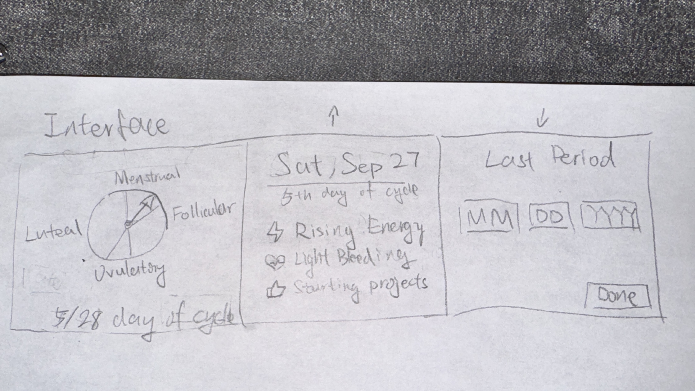 

## Clock Design
***Initial desgin of period clock***:
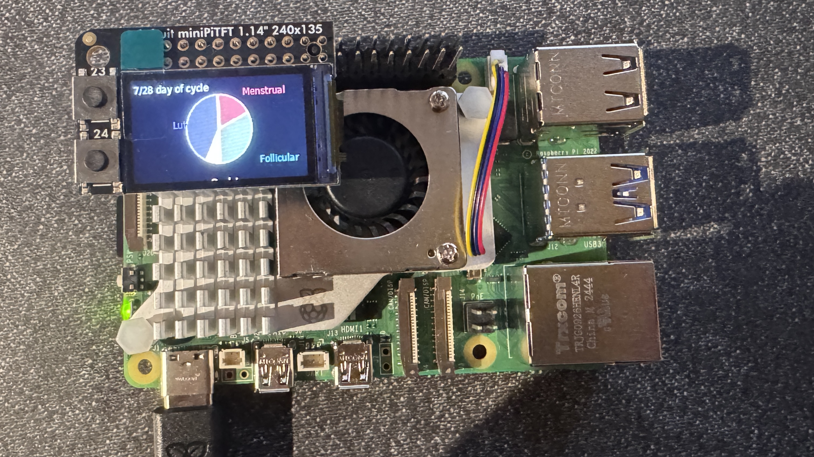 
In a typical menstrual cycle, the four phases—Menstrual, Follicular, Ovulatory, and Luteal—do not occupy equal lengths of time. Representing them as evenly sized segments would be misleading and reduce the accuracy of the visual display. Thus, I would like to think there are four uneven colored pie slices on the background of our clock indicating the four phases.

To create the uneven colored pie slices for our clock background, I calculated the angle of each menstrual phase (Menstrual, Follicular, Ovulatory, Luteal) based on its actual length in days relative to the full cycle. Using these proportions, I used draw.pieslice() to render each section with a distinct color. This visual design is important because it reflects the true duration of each phase rather than dividing the cycle evenly, giving users a more accurate and intuitive understanding of where they are in their cycle. 

However, as I  drew the phase labels directly on the pie chart, they overlapped and clipped against each other. The text for the cycle day also touched the edge of the circle, making the chart hard to read. To fix it, I decided to remove all labels from the pie itself. Instead, I created a clean 2-column legend at the bottom of the screen. I also shorten the day text aviod overlap.

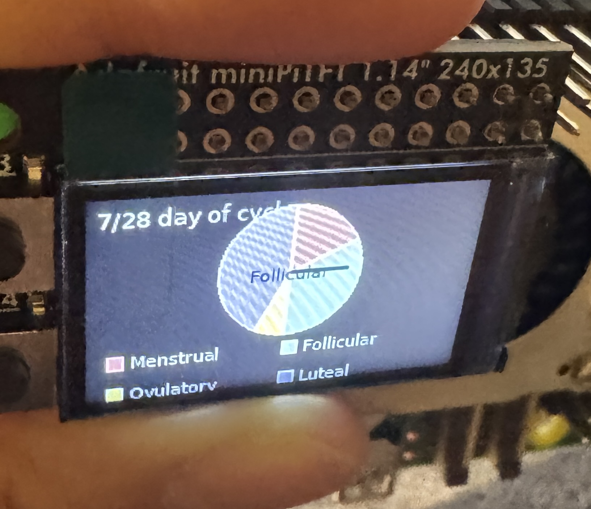 

At first, I added a phase label right at the center of the clock. I thought it would make it clearer which phase the user was in, but when I saw it on the screen, it felt distracting. It pulled attention away from the overall chart. So, I removed that center label to keep the design simpler and cleaner.

I also changed the arrow color to black. The old color blended too much into the background and the pie slices. With black, the arrow is sharp and easy to see, making it stand out against all the phase colors. This small change improved readability a lot.

***Final desgin of the period clock***:
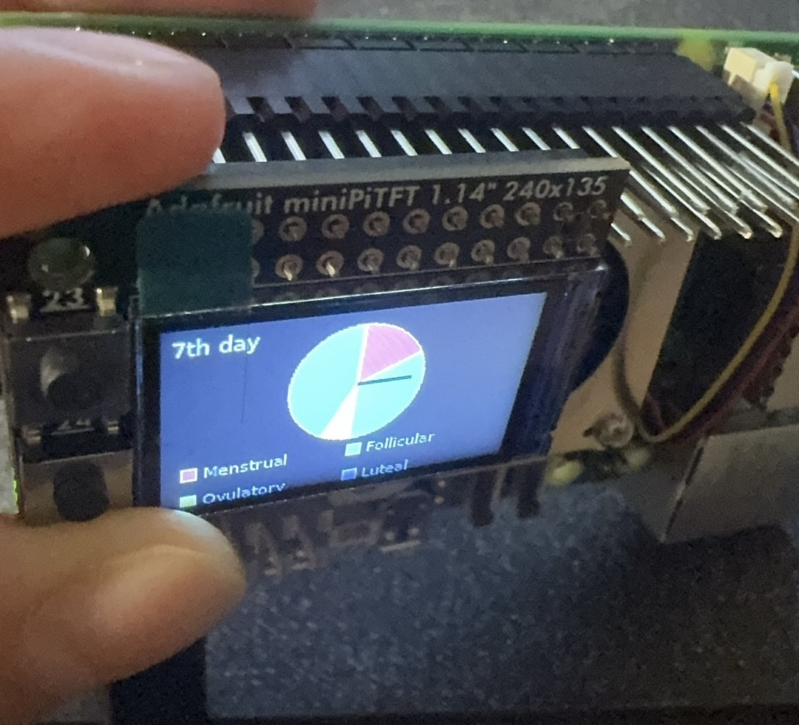 

## Summary Screen Design
***Initial desgin of the summary screen***:
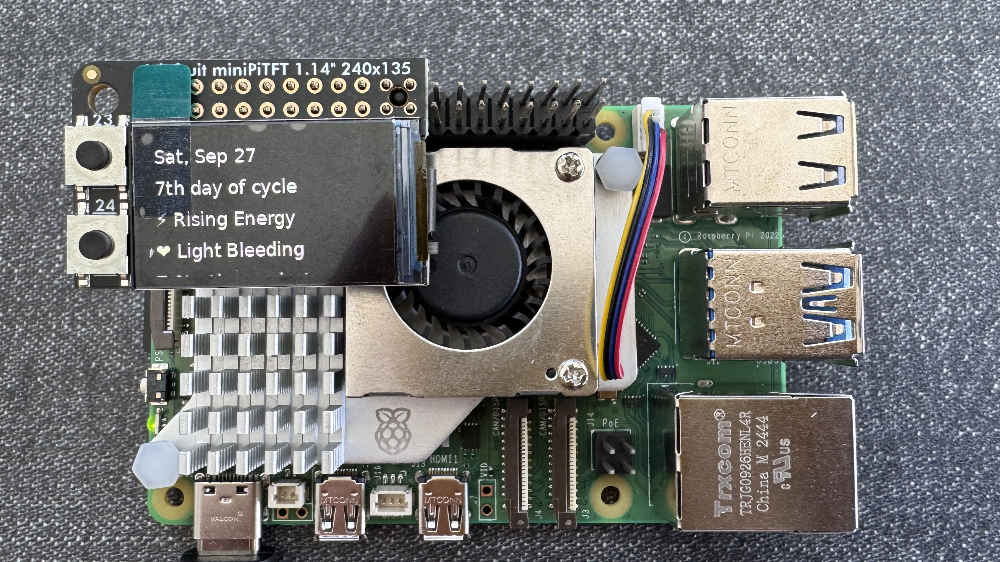 
Originally, the second screen was very plain and unstructured. It only showed text stacked together without any clear grouping, which made it difficult to follow. The phase and day information blended into the rest of the content, so users couldn’t easily see the most important details at a glance. Without a background panel or divider, the screen felt crowded and flat. The snapshot items—how you feel, a symptom to expect, and one thing to try—were displayed as regular text lines with no hierarchy, which made their purpose unclear.

To solve this, I redesigned the summary screen to be more organized, readable, and visually balanced. I added a card-style background with rounded corners so that all the content feels grouped together and easier to read. At the top of the card, I placed the current date (from the system’s local time) on the left and a phase badge on the right. This layout allows users to quickly see both the actual calendar date and where they are in their cycle without confusion.

I also added a divider line below the header to clearly separate it from the details, giving the layout a more structured look. For the main content, I introduced a “Today’s snapshot” section. Instead of long text blocks, I broke the information into three simple bullet rows: how you feel, a symptom to expect, and one thing to try. To make these even clearer, I gave each row a distinct colored line marker—teal, red, or yellow—so the items can be recognized at a glance and are easier to distinguish. These snapshot items also change automatically based on the user’s current cycle day, so the guidance feels timely and relevant.

***Final desgin of the summary screen***:
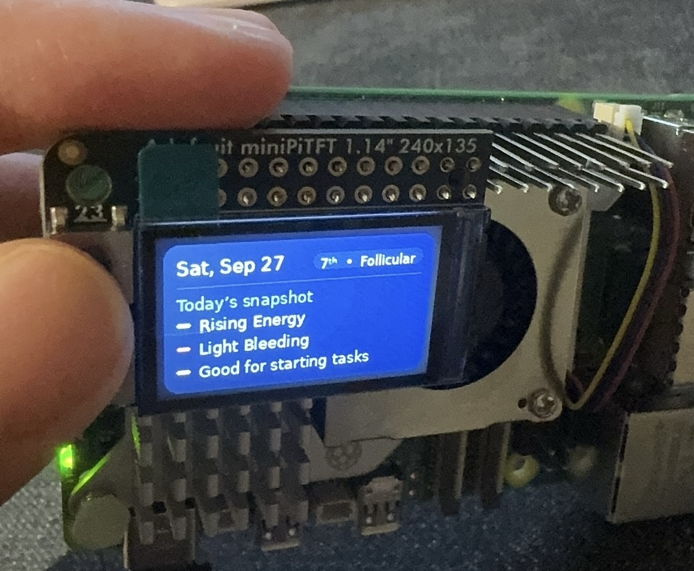 

## Input Screen Design
***Initial desgin of the user input screen***:
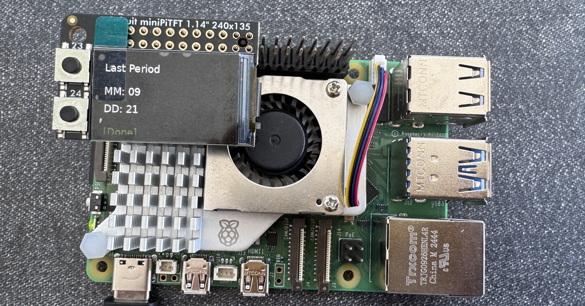 

At first, this screen was labeled “Last Period”, but it wasn’t really an input screen. It just showed static text with “MM” and “DD” values, which looked like placeholders but couldn’t actually be edited. The bottom had a “[Done]” line, but it wasn’t a proper button. On top of that, the wording “Last Period” was unclear. It didn’t tell users whether they should enter the first day, last day, or something else, so it was both misleading and unusable.

I redesigned it into a proper input panel titled “First Day of Last Period” to make the meaning clear that the cycle is always counted starting from day one of bleeding, not from the end of the period. Now the screen has real editable fields for Month and Day. The active field highlights, so users know exactly where they are. Button A switches between fields and the Save button, while Button B changes the numbers (short press to increase, long press to decrease). At the bottom, I replaced the plain “[Done]” text with a real green Save button. After saving, a temporary “Saved” badge appears, giving feedback. I also added validation so users can’t save a future date. Most importantly, the saved date is now stored and used by the other screens to calculate the cycle day and phase correctly.

***Final desgin of the user input screen***:
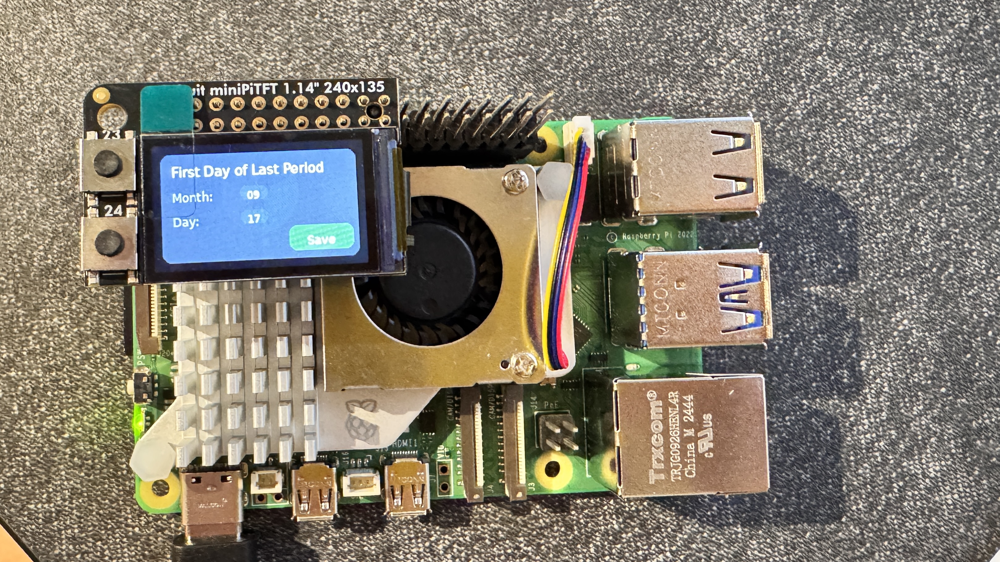 

## Button Logic & Interaction Design

Since the device only has two hardware buttons, I tried my best to design a simple but effective interaction model. Button A is used to cycle through options: on the input screen it moves the focus between Month, Day, and Save, and on other screens it switches between the clock, summary, and input screens. Button B is used to change values, with a short press increasing the number and a long press decreasing it. 

## Make a short video of your modified barebones PiClock
***A copy of your code should be in your Lab 2 Github repo.***
screen_clock.py

\*\*\***Take a video of your PiClock.**\*\*\*

[Watch the demo video](https://drive.google.com/file/d/1upCayziQyvRpw-Sf5W8fHvfIWTW5qL5K/view?usp=sharing)

In the demo video, I showcased the general functionality of the clock using a default cycle day. The video begins with the ***main screen***, where the period clock and cycle day text are displayed together. I then switch to ***the second screen***, which presents the summary details for the specific cycle day, including energy, symptoms, and suggested activities. After that, I move to ***the third screen***, where users can input the first day of their last period. To demonstrate the validation feature, I first try entering a future date, which gets rejected and triggers a message explaining that a future date cannot be used. I then enter a valid past date, and the system successfully saves it. Finally, I return to the first two screens to show how the saved input updates the clock visualization and the summary details accordingly.

## Limitations and Future Improvements

One limitation of my current design is that it assumes a standard 28-day cycle. In reality, people’s menstrual cycles vary a lot, and using a fixed length reduces the accuracy of the clock. A better design would include an input for users to enter their own average cycle length, or even better, allow the system to collect data over time and calculate a personalized average automatically. With that, the device could also start predicting the next period more reliably.

Another limitation is that I haven’t considered how to handle late or irregular periods. If I had more time, I would like to explore ways to incorporate flexibility in the design, such as warning users when the expected date has passed and adjusting the cycle calculation accordingly.

I also haven’t implemented ways to track more detailed symptoms or mood logs. Right now, the “snapshot” screen only shows generic suggestions. A more advanced version could let users input daily experiences (like cramps, bloating, or mood changes) and then visualize trends over time. This would make the system more personal and useful for long-term self-tracking.

## Note on AI Assistance

For this lab, I used ChatGPT to help me summarize my design decisions and rewrite some sections into clearer paragraphs. All reflection points and design choices are my own. Also, some of my script was coded using the assistance of ChatGPT.

