# Observant Systems

### Part A

### Play with different sense-making algorithms.

#### Teachable Machines

I used Teachable Machines to create my own pose classifier that recognizes two actions: looking at a cellphone and drinking water. To train the model, I collected around 200 image samples for each class using my webcam and exported the trained model as a TensorFlow Lite file for use on the Raspberry Pi. This process was simple and intuitive because Teachable Machines provides a visual interface — I didn’t need to write any code or manually label data.
Compared to OpenCV or MediaPipe, Teachable Machines offers a much easier way to customize what the model learns. While OpenCV and MediaPipe use predefined detection methods, Teachable Machines lets me define my own classes based on any kind of image data. This gives it greater flexibility for personalized recognition tasks, such as detecting specific objects, gestures, or activities. However, Teachable Machines models are more general and may be less efficient or less precise than optimized pipelines like MediaPipe for specific tasks such as pose or hand tracking.

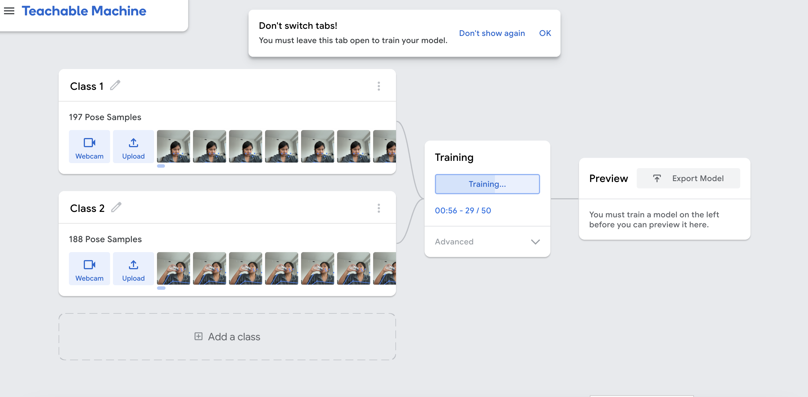
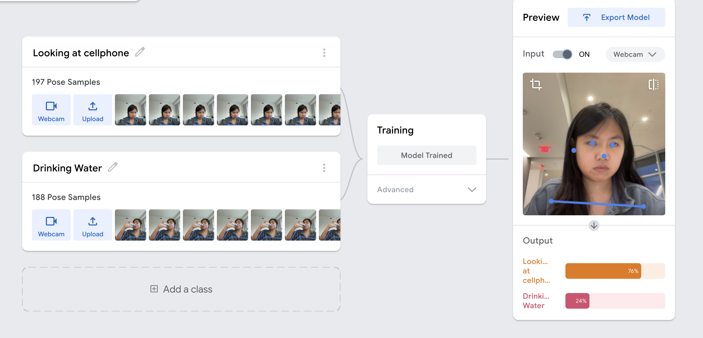

### Part B

### Human Detection Greeter System

***Motivation: Encouragement for Solo Study***

As someone who lives alone, I often struggle with staying focused and motivated, especially when it comes to sitting down at my desk to begin work. Without external accountability or subtle social cues, it can be easy to avoid starting tasks or get stuck in a state of inertia. I became curious whether a lightweight, ambient form of interaction — something as simple as a warm "Welcome!" — could serve as a positive nudge to shift me into a productive mindset. This curiosity led to the development of a small but meaningful system: a Raspberry Pi-powered greeter that detects when I approach my desk and welcomes me with visual and auditory feedback.

***Model Design: Custom Human Classifier***

To power the detection, I trained a custom image classification model using Google’s Teachable Machine platform. The model was built with two primary classes: "Human" and "Not Human." For the "Human" class, I uploaded around 400 images of myself sitting at my desk, taken under varied lighting conditions, camera angles, and wearing different outfits. Some of the images included partial occlusion—such as my hand raised or my body leaning to one side—to help the model generalize across real-world variations.

The "Not Human" class consisted of approximately 200 images showing the same environment without me present. These included common desk objects such as pencil cases, iPads, and books, as well as furniture like chairs and monitors that might visually resemble a person when seen from certain angles. This diversity helped the model distinguish between actual human presence and background clutter.

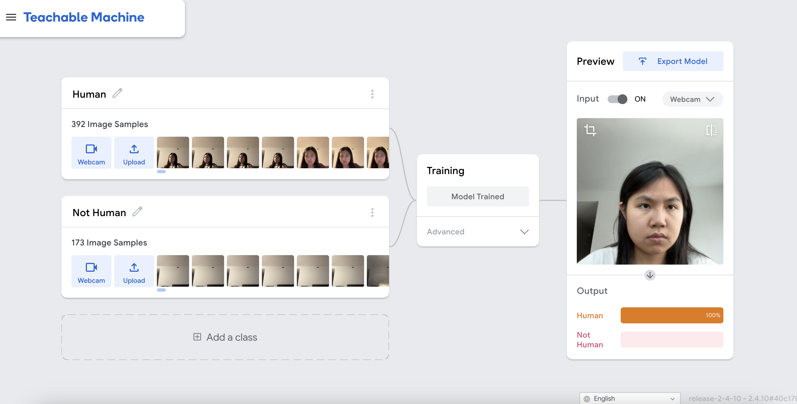

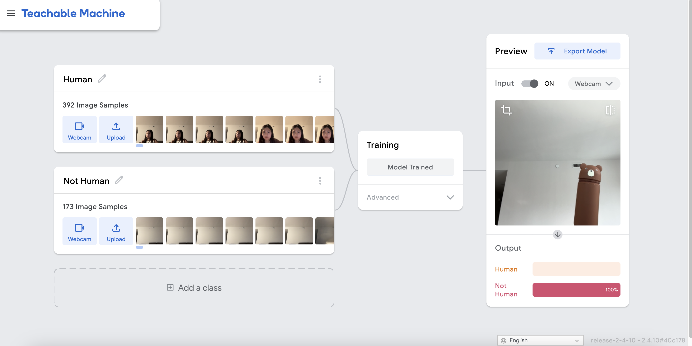
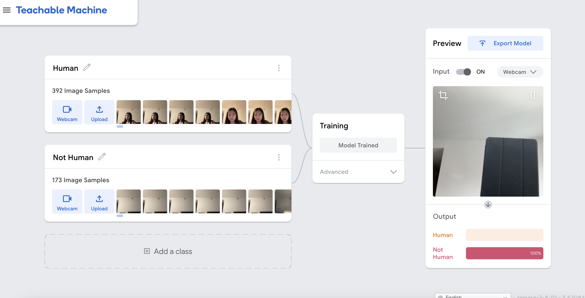
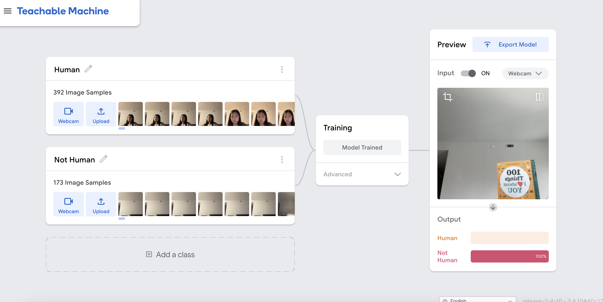

One interesting edge case emerged during testing: I placed a Chappell Roan album poster in front of the camera, and the model briefly identified it as a human. While technically a false positive, I considered this acceptable given the limitations of image classification at a glance, and it didn’t affect the practical goal of encouraging me to sit at my desk to study.
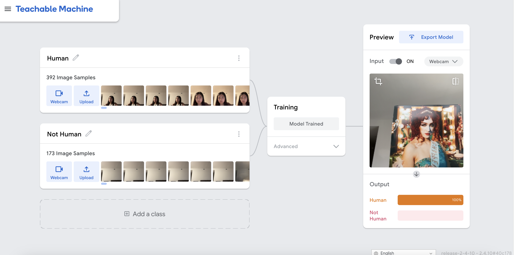

***Model Export and Deployment***

Once I was satisfied with the model’s performance, I exported it from Teachable Machine as a TensorFlow Lite model, which is optimized for use on Raspberry Pi. The export generated two files: a .tflite model file containing the compressed classifier, and a labels.txt file mapping numeric class IDs to class names. These files were transferred to my Pi using the scp command-line tool.

On the Raspberry Pi, I wrote a Python script that uses the teachable_machine_lite module and OpenCV to capture live camera frames. Each frame is passed through the classifier, and the prediction is checked for its top label and confidence. The system is programmed to treat any detection of "Human" with over 80% confidence as a true positive and respond accordingly.

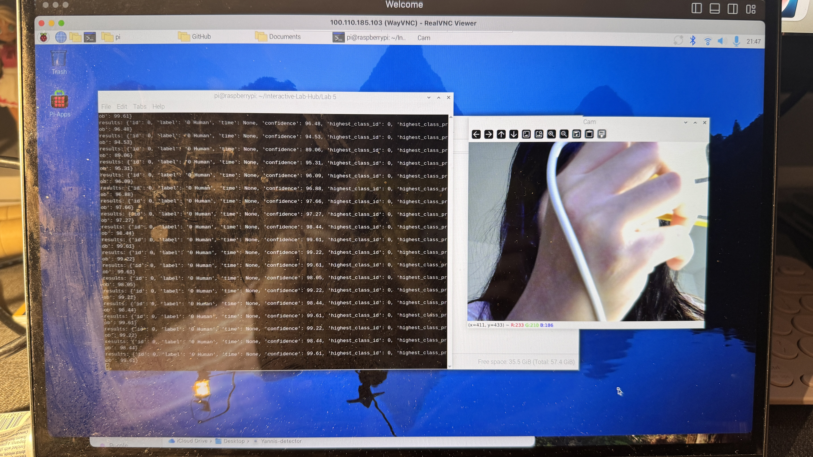
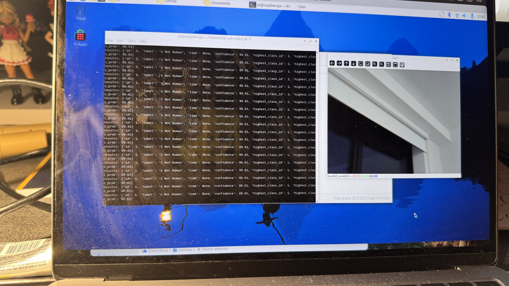

***System Setup and Functionality***

The hardware configuration for this interaction includes a Raspberry Pi paired with a webcam for real-time image capture and a 1.14-inch Adafruit ST7789 TFT screen for visual output. At startup, the screen displays a neutral standby message: “Waiting… Scanning for human.” This early screen setup was intentionally designed to prevent a bug encountered in earlier iterations, where the display would default to an unintended “Welcome!” message even before any inference was complete. To address this, the system now only transitions to the greeting screen after receiving a valid detection result.

Once the model detects a human with a confidence score above 80%, the system dynamically updates the display to show a green-background message: “Welcome! Human Detected.” This visual feedback provides a friendly and ambient interaction, reinforcing presence awareness in the space. After five seconds, the display automatically reverts to its scanning mode, preparing for the next interaction.

If no human is detected or if confidence is too low, the system maintains the default “Waiting...” message without redundantly repeating outputs. This state machine prevents flickering and creates a smoother user experience. The backlight remains on once the initial detection completes, allowing the screen to remain visibly responsive throughout the session.

***Exploration of Inputs and Outputs***

To explore input variation, I tested the model under several real-world conditions. I tried approaching the desk from different angles and distances, observed the effect of varied lighting (daylight, overhead lamp, and dim light), and experimented with partial occlusion — for instance, wearing a hoodie, leaning sideways, or partially hiding behind the monitor. The model consistently handled these variations well, maintaining high accuracy in detecting a human presence.

For output variation, I initially started with just visual feedback using the TFT screen. Later, I added audio output via the espeak library to create a spoken “Welcome!” message when a person is detected. This not only made the system feel more interactive and friendly but also allowed it to function as a useful ambient cue, especially when I’m not directly looking at the screen.

Exploring these input and output combinations helped me understand how multi-sensory interaction can improve the effectiveness of a simple system. The auditory feedback is especially helpful during low-light settings or when I’m approaching the desk from the side. Meanwhile, the visual feedback reinforces the feeling of being “seen” or acknowledged, which contributes to the motivational aspect of the system.

### Part C
### Test the interaction prototype

During testing, the system performed reliably in most scenarios. It correctly identified me as a human even when I was standing far away from the camera, and it maintained high accuracy across different poses, such as turning sideways or wearing a mask. I was also impressed that it did not misclassify non-human objects, even when I moved items like a pillows, iPad, or book directly in front of the camera. These results suggest the model is robust against everyday desk clutter and movement.

However, there were a few notable failure cases. When I held up a hoodie—without myself being visible—the system sometimes misclassified it as a human. Similarly, a poster of Chappell Roan showing her full frontal face occasionally triggered a false positive. While this type of misclassification is understandable given the visual similarity, it is less concerning in this context since the system is designed to offer a friendly prompt rather than make high-stakes decisions. The model also struggled in extremely low-light conditions, failing to detect me reliably when the lighting was too dim for the camera to capture clear features.

Based on these observations, other potential failure scenarios may include highly realistic human-shaped mannequins, face-like drawings near the camera, or someone walking past the camera wearing bulky clothes that distort shape. While these edge cases may lead to occasional false positives, they do not critically impact the goal of creating a motivational, human-responsive study environment.

**\*\*\*Think about someone using the system. Describe how you think this will work.\*\*\***
1. Are they aware of the uncertainties in the system?
1. How bad would they be impacted by a miss classification?
1. How could change your interactive system to address this?
1. Are there optimizations you can try to do on your sense-making algorithm.

If someone else were to use this system, it would feel like a quiet, ambient interaction rather than a tool that demands attention. When they walk up to the desk, the system notices their presence and displays a friendly welcome message, offering a small psychological nudge to begin working. Because the interface is intentionally simple and does not show confidence levels or internal reasoning, most users would not be explicitly aware of the system’s uncertainties. They are likely to assume the device is confident in its decisions even though the underlying model is making best-guess classifications frame by frame.

The impact of a misclassification in this context is minimal. A false negative—failing to detect someone who is actually there—would simply delay the welcome message, which is not disruptive. A false positive—triggering a welcome message when no one is present—might feel slightly amusing or unexpected, but it poses no real problem since the system is not enforcing productivity or making high-stakes decisions. The overall experience remains low-pressure and forgiving.

If needed, there are interaction-level refinements that could make the system feel more transparent or consistent. For example, introducing a brief moment of visual settling before switching screens, or using a softer intermediate “checking…” state, could help communicate that the system is processing the scene rather than reacting instantly to every frame. These adjustments are optional, but they could make the device’s behavior feel smoother and help users form a clearer mental model of what the system is doing.

Testing the prototype also revealed opportunities to improve the sense-making algorithm itself. Adding more diverse “Not Human” examples—especially objects that previously caused false positives, such as hoodies or posters—would help the model better distinguish human presence from background clutter. Capturing additional training images in dim or uneven lighting would also improve performance at night, when most of the model’s false negatives occurred.

If future versions required more reliability, the system could also incorporate an additional sensor, such as a passive infrared (PIR) motion detector or simple proximity sensor, to provide a second source of evidence. While this is not necessary for a motivational desk companion, multi-sensor fusion could be helpful if the system were used in more dynamic environments or shared spaces.

### Part D
### Characterize your own Observant system

***What can you use this system for?***

This system is designed to create an ambient cue for study motivation. When a person approaches the desk, the system detects their presence and displays a welcoming message. It can be used as a soft nudge to help users begin a focused session, or even as a lightweight check-in mechanism of study time.

***What is a good environment for this system?***

The system works best in a well-lit, indoor space where the lighting is consistent and the background is relatively static. It thrives when used by a single primary user, particularly in solo work setups where desk layout and background conditions are predictable.

***What is a bad environment for this system?***

The system struggles in low-light or heavily cluttered environments. It may also misclassify things in shared or dynamic spaces — such as public libraries or co-working spaces — where multiple people, posters, or objects move in and out of frame frequently.

***When will it break?***

It will likely break in very dim conditions where the camera cannot capture clear input, or when unfamiliar objects (e.g. posters of human faces, or clothes with human-like form) are presented. The model might also break if the user makes significant appearance changes not represented in training (e.g., wearing a full costume or hat).

***When it breaks, how will it break?***

It typically breaks by producing a false positive, such as misclassifying a static object as a human, or a false negative, where a real human is not detected due to low confidence. In both cases, the user might see a wrong message (“Welcome!” when no one is there, or no message when they are present).

***Other properties or behaviors?***

The system responds quickly and does not require active input, making it feel seamless. It does not require an internet connection once deployed and can be customized with other outputs, such as audio or smart light integration, making it extensible.

***How does it feel?***

The interaction feels ambient and gentle — not intrusive, but quietly encouraging. It blends into the background of your daily routine, almost like a digital pet that acknowledges your presence and helps anchor your focus.

### Part 2.

***Model Improvements***
Based on the failure cases identified in Part 1, I retrained the model with a more intentionally designed dataset. The original version contained enough “Human” images but an insufficient variety of “Not Human” examples, which caused occasional false positives—especially when objects such as hoodies or posters resembled human shapes. To address this, I expanded the “Not Human” class to include more ambiguous or confusable objects, such as bulky clothing, printed faces, and desk items positioned close to the camera. I also collected additional samples in dim or uneven lighting, since most false negatives occurred at night when the camera struggled to capture clear visual features. After retraining, the updated model showed fewer false positives and significantly more stability in edge cases. These improvements demonstrate how targeted augmentation of the dataset can meaningfully increase robustness without changing the system’s overall architecture.

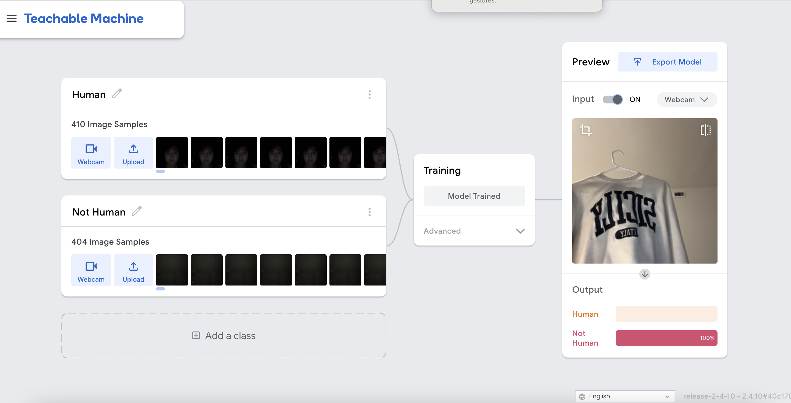
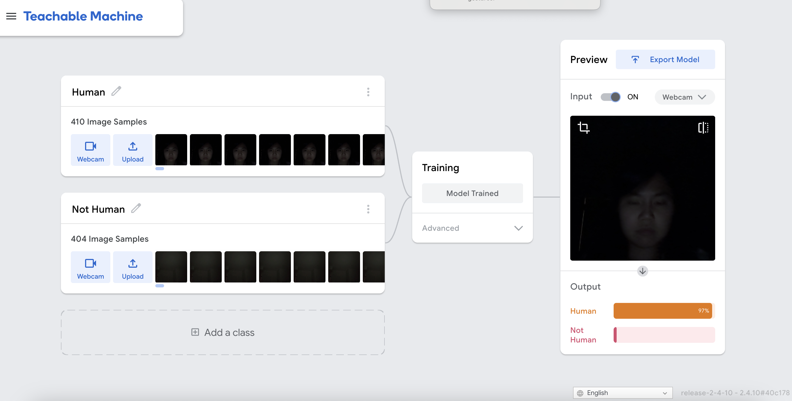

***Interaction Improvements***

To make the interaction feel warmer and more personal, I updated the system to deliver time-specific motivational messages. Instead of repeating the same greeting throughout the day, the device now chooses a context-appropriate message—for example, “Good morning! You’ve got this.” in the morning or “Good evening. Let’s get a bit done.” later at night. This adds subtle variability to the interaction and helps the system feel more responsive to the user’s daily rhythm.

I also improved the quality of the spoken audio. The original version used Flite’s default voice, which sounded noticeably robotic and out of place for a device meant to offer gentle encouragement. By switching to a more natural-sounding built-in voice, the spoken prompts now convey a friendlier tone without adding complexity to the system. These updates together make the interaction feel more pleasant and intentional, while still keeping the overall design lightweight and focused.

 
 
 

***Additional Areas for Future Improvement***

Testing highlighted several opportunities for future refinement. The system could benefit from a brief transitional “Checking…” state to smooth the switch between scanning and greeting, helping users form a better mental model of the device’s behavior. Performance in extremely low-light scenarios could also be improved with further nighttime training data. If higher reliability were ever required, the system could incorporate a secondary sensor—such as a passive infrared (PIR) motion detector—to complement the image classifier. While not necessary for a motivational desk companion, these options point toward meaningful next steps should the system be deployed in more dynamic environments.

### Notes on AI Assistant

For this lab, I used ChatGPT to help me summarize my design decisions and rewrite some sections into clearer paragraphs. All reflection points and design choices are my own. Also, some of my script was coded using the assistance of ChatGPT.
