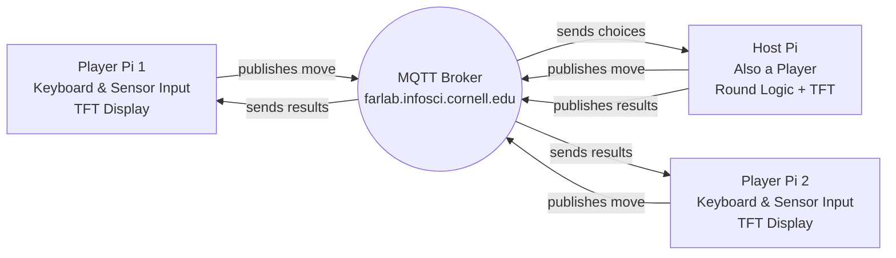

# Distributed Interaction

**Amy Chen (ac3295) & Yannis Zhu (yz3477)**
---

## Part A: MQTT Messaging

We successfully connected to the broker and exchanged messages between devices.  
However, we noticed that the messages appeared and disappeared too quickly in the MQTT Explorer.

[](https://youtube.com/shorts/vS_I9qKc26g?feature=share)

**💡 Brainstorm 5 ideas for messaging between devices**

1. Trivia game to play against your friends 
2. Play rock paper scissors against your friends
3. Play counting game against your friends (21)
4. Door open sensor, send message to group when the door opens 
5. Publishes temperatures to the group every 20 minutes for each room 
---

## Part B: Collaborative Pixel Grid
**📸 Include: Screenshot of grid + photo of Pi setup**


---

## Part C: Make Your Own

**Requirements:**
- 3+ people, 3+ Pis
- Each Pi contributes sensor input via MQTT
- Meaningful or fun interaction

**Ideas:**

**Sensor Fortune Teller**
- Each Pi sends 0-255 from different sensor
- Server generates fortunes from combined values

**Frankenstories**
- Sensor events → story elements (not text!)
- Red = danger, gesture up = climbed, distance <10cm = suddenly

**Distributed Instrument**
- Each Pi = one musical parameter
- Only works together

**Others:** Games, presence display, mood ring

### Deliverables

Replace this README with your documentation:

**1. Project Description**
- What does it do? Why interesting? User experience?

Our project is an online Rock–Paper–Scissors game that allows multiple players to play together in real time using MQTT messaging between Raspberry Pis. Each Pi represents a player and publishes their chosen move (rock, paper, or scissors) to the shared MQTT broker. The host Pi collects all moves, determines the winner, and broadcasts the results back to all players.

This setup transforms a simple hand game into a distributed interactive system, enabling fast, low-latency gameplay that outperforms typical video-call-based interactions. By transmitting lightweight text messages instead of video streams, the game ensures smooth, synchronized rounds among players and demonstrates the power of MQTT for real-time, multi-device coordination.

**2. Architecture Diagram**
- Hardware, connections, data flow
- Label input/computation/output





**3. Build Documentation**
- Photos of each Pi + sensors
- MQTT topics used
- Code snippets with explanations


For our Rock–Paper–Scissors game, each Pi communicates through a small set of MQTT topics:

***Player → Host: Publish Move***

Each player publishes their move (rock, paper, or scissors) to a unique topic: 
```bash
IDD/rps/choices/<playerName>
```
Examples:
```bash
IDD/rps/choices/amy
IDD/rps/choices/yannis
IDD/rps/choices/host
```
This is how the Host collects everyone’s moves for each round.

***Host → All Players: Publish Game Updates***

The Host sends all game status messages on a shared topic:
```bash
IDD/rps/status
```

Messages on this topic include things like:

-“New round! 10s to play!”

-“Winning move: ROCK”

-“Champion: yannis”

-“Waiting for players to join...”

Every Player Pi subscribes to this topic so the TFT screen updates in real time.

***Host: Subscribe to All Player Moves***

The Host listens to every player's move using a wildcard:
```bash
IDD/rps/choices/#
```

This matches our code:
```bash
client.subscribe("IDD/rps/choices/#")
```

This lets the Host collect all moves for the current round (no matter how many players join), update the game state, and broadcast the next status message.

### Code snippets with explanations

***Player Code Snippet: Publishing a Move***
```bash
topic_choice = f"IDD/rps/choices/{player_name}"
client.publish(topic_choice, msg)
```
The Player Pi takes keyboard input (rock, paper, scissors), and publishes it to the player’s unique MQTT topic. The Host listens to all these topics and stores each move.

***Player Subscribes to Results***
```bash
client.subscribe("IDD/rps/status")
```
Players receive all game updates (start round, winner, elimination, champion) via a shared topic. Messages are also displayed on the TFT screen.

***Host Code Snippet: Collecting Moves***
```bash
client.subscribe("IDD/rps/choices/#")

def on_message(client, userdata, msg):
    player = msg.topic.split("/")[-1]
    choice = msg.payload.decode().strip()
    choices[player] = choice
```
The Host receives moves from all players using a wildcard subscription. Each message is stored in the choices dictionary.

***Host Code Snippet: Determining Winner***
```bash
def determine_winner(players_choices):
    unique = set(players_choices.values())
    if len(unique) == 1 or len(unique) == 3:
        return None     # tie
    if unique == {"rock", "scissors"}: return "rock"
    if unique == {"scissors", "paper"}: return "scissors"
    if unique == {"paper", "rock"}: return "paper"
```
This function calculates the winning move based on player submissions. The Host then eliminates players whose moves don’t match the winning move.

**4. User Testing**
- **Test with 2+ people NOT on your team**
- Photos/video of use
- What did they think before trying?
- What surprised them?
- What would they change?


**5. Reflection**
- What worked well?
- Challenges with distributed interaction?
- How did sensor events work?
- What would you improve?

---

## Code Files

**Server files:**
- `app.py` - Pixel grid server (Flask + WebSocket + MQTT)
- `mqtt_viewer.py` - MQTT message viewer for debugging
- `mqtt_bridge.py` - MQTT → WebSocket bridge
- `requirements-server.txt` - Server dependencies

**Pi files:**
- `pixel_grid_publisher.py` - Example (RGB sensor → MQTT)
- `requirements-pi.txt` - Pi dependencies

**Web interface:**
- `templates/grid.html` - Pixel grid display
- `templates/controller.html` - Color picker
- `templates/mqtt_viewer.html` - Message viewer

---

## Debugging Tools

**MQTT Message Viewer:** `http://farlab.infosci.cornell.edu:5001`
- See all MQTT messages in real-time
- View topics and payloads
- Helpful for debugging your own projects

**Command line:**
```bash
# See all IDD messages
mosquitto_sub -h farlab.infosci.cornell.edu -p 1883 -t "IDD/#" -u idd -P "device@theFarm"
```

---

## Troubleshooting

**MQTT:** Broker `farlab.infosci.cornell.edu:1883`, user `idd`, pass `device@theFarm`

**Sensor:** Check `i2cdetect -y 1`, APDS-9960 at `0x39`

**Grid:** Verify server running, check MQTT in console, test with web controller

**Pi venv:** Make sure to activate: `source .venv/bin/activate`


---

## Submission Checklist

Before submitting:
- [ ] Delete prep/instructions above
- [ ] Add YOUR project documentation
- [ ] Include photos/videos/diagrams  
- [ ] Document user testing with non-team members
- [ ] Add reflection on learnings
- [ ] List team names at top

**Your README = story of what YOU built!**

---

Resources: [MQTT Guide](https://www.hivemq.com/mqtt-essentials/) | [Paho Python](https://www.eclipse.org/paho/index.php?page=clients/python/docs/index.php) | [Flask-SocketIO](https://flask-socketio.readthedocs.io/)
