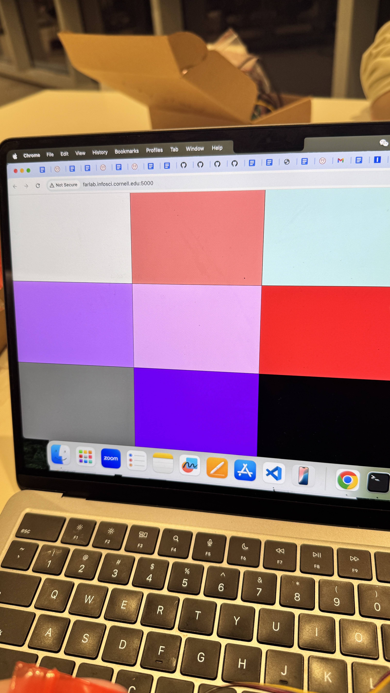
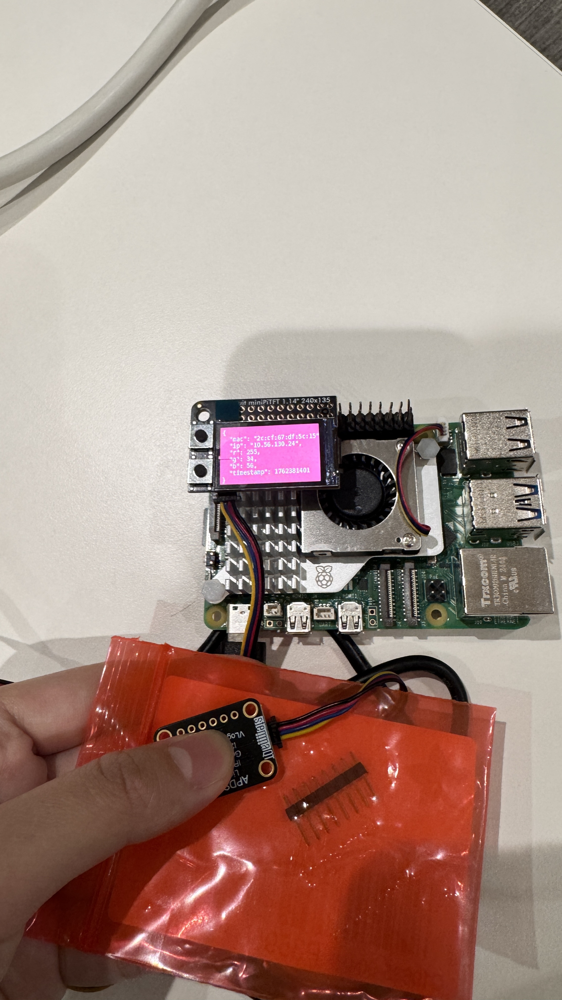
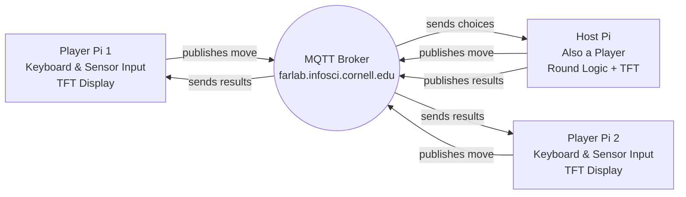
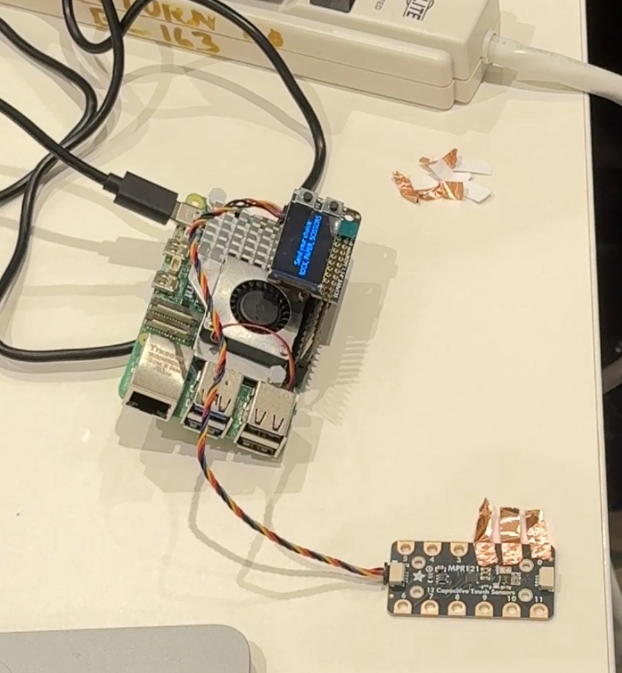
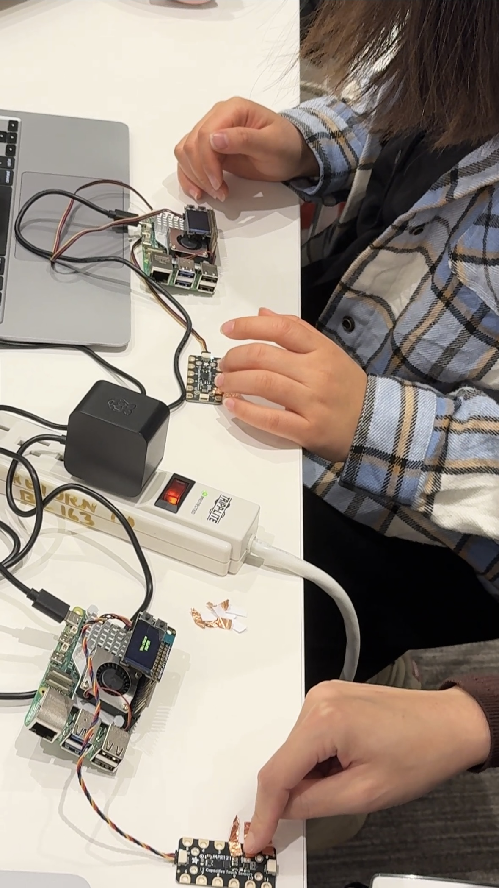
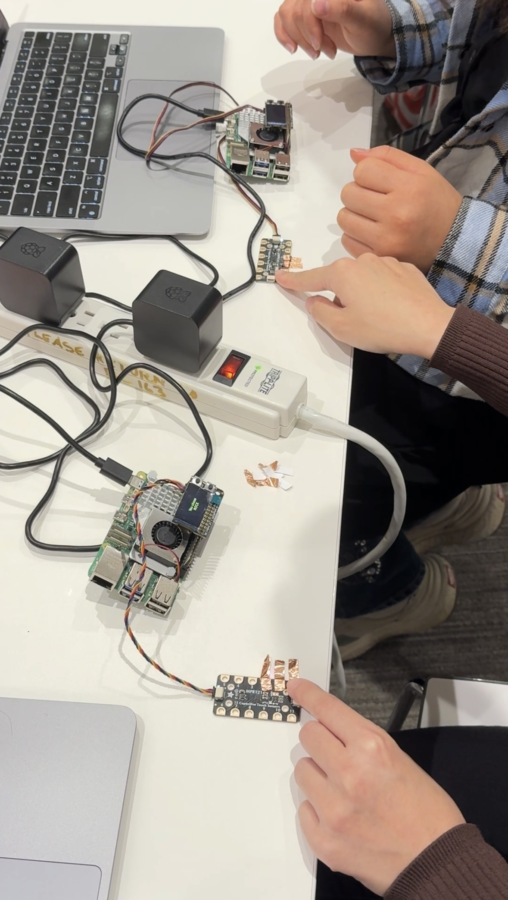
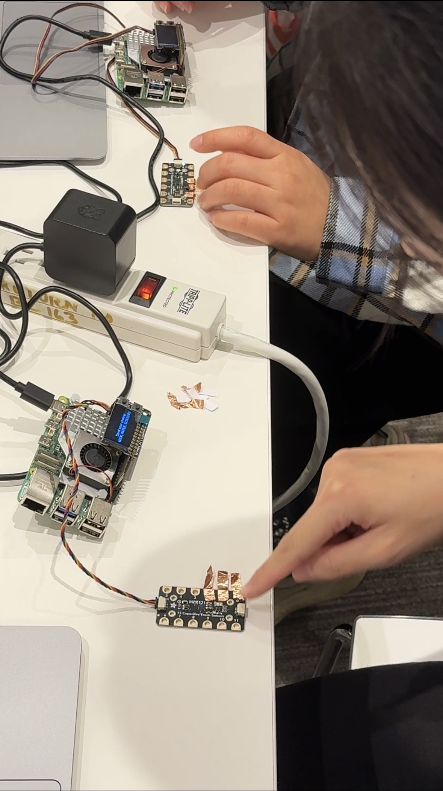

# Distributed Interaction

**Amy Chen (ac3295) & Yannis Zhu (yz3477)**
---

## Part A: MQTT Messaging

We successfully connected to the broker and exchanged messages between devices.  
However, we noticed that the messages appeared and disappeared too quickly in the MQTT Explorer.

[](https://youtube.com/shorts/vS_I9qKc26g?feature=share)

**💡 Brainstorm 5 ideas for messaging between devices**

1. Trivia game to play against your friends 
2. Play rock paper scissors against your friends
3. Play counting game against your friends (21)
4. Door open sensor, send message to group when the door opens 
5. Publishes temperatures to the group every 20 minutes for each room 
---

## Part B: Collaborative Pixel Grid
**📸 Include: Screenshot of grid + photo of Pi setup**




---

## Part C: Make Your Own

**Requirements:**
- 3+ people, 3+ Pis
- Each Pi contributes sensor input via MQTT
- Meaningful or fun interaction

**Ideas:**

**Sensor Fortune Teller**
- Each Pi sends 0-255 from different sensor
- Server generates fortunes from combined values

**Frankenstories**
- Sensor events → story elements (not text!)
- Red = danger, gesture up = climbed, distance <10cm = suddenly

**Distributed Instrument**
- Each Pi = one musical parameter
- Only works together

**Others:** Games, presence display, mood ring

### Deliverables

Replace this README with your documentation:

**1. Project Description**
- What does it do? Why interesting? User experience?

Our project is an online Rock–Paper–Scissors game that allows multiple players to play together in real time using MQTT messaging between Raspberry Pis. Each Pi represents a player and publishes their chosen move (rock, paper, or scissors) to the shared MQTT broker. The host Pi collects all moves, determines the winner, and broadcasts the results back to all players.

This setup transforms a simple hand game into a distributed interactive system, enabling fast, low-latency gameplay that outperforms typical video-call-based interactions. By transmitting lightweight text messages instead of video streams, the game ensures smooth, synchronized rounds among players and demonstrates the power of MQTT for real-time, multi-device coordination.

**2. Architecture Diagram**
- Hardware, connections, data flow
- Label input/computation/output





**3. Build Documentation**
- Photos of each Pi + sensors
- MQTT topics used
- Code snippets with explanations

The project runs on a Raspberry Pi with a small ST7789 TFT screen showing game prompts, while an MPR121 capacitive touch board with three metal pads serves as the physical interface for selecting rock, paper, or scissors.



For our Rock–Paper–Scissors game, each Pi communicates through a small set of MQTT topics:

***Player → Host: Publish Move***

Each player publishes their move (rock, paper, or scissors) to a unique topic: 
```bash
IDD/rps/choices/<playerName>
```
Examples:
```bash
IDD/rps/choices/amy
IDD/rps/choices/yannis
IDD/rps/choices/host
```
This is how the Host collects everyone’s moves for each round.

***Host → All Players: Publish Game Updates***

The Host sends all game status messages on a shared topic:
```bash
IDD/rps/status
```

Messages on this topic include things like:

-“New round! 10s to play!”

-“Winning move: ROCK”

-“Champion: yannis”

-“Waiting for players to join...”

Every Player Pi subscribes to this topic so the TFT screen updates in real time.

***Host: Subscribe to All Player Moves***

The Host listens to every player's move using a wildcard:
```bash
IDD/rps/choices/#
```

This matches our code:
```bash
client.subscribe("IDD/rps/choices/#")
```

This lets the Host collect all moves for the current round (no matter how many players join), update the game state, and broadcast the next status message.

### Code snippets with explanations

***Player Code Snippet: Publishing a Move***
```bash
topic_choice = f"IDD/rps/choices/{player_name}"
client.publish(topic_choice, msg)
```
The Player Pi detects which touch pad was activated on the MPR121 sensor and publishes the corresponding move (rock, paper, scissors).

***Player Subscribes to Results***
```bash
client.subscribe("IDD/rps/status")
```
Players receive all game updates (start round, winner, elimination, champion) via a shared topic. Messages are also displayed on the TFT screen.

***Host Code Snippet: Collecting Moves***
```bash
client.subscribe("IDD/rps/choices/#")

def on_message(client, userdata, msg):
    player = msg.topic.split("/")[-1]
    choice = msg.payload.decode().strip()
    choices[player] = choice
```
The Host receives moves from all players using a wildcard subscription. Each message is stored in the choices dictionary.

***Host Code Snippet: Determining Winner***
```bash
def determine_winner(players_choices):
    unique = set(players_choices.values())
    if len(unique) == 1 or len(unique) == 3:
        return None     # tie
    if unique == {"rock", "scissors"}: return "rock"
    if unique == {"scissors", "paper"}: return "scissors"
    if unique == {"paper", "rock"}: return "paper"
```
This function calculates the winning move based on player submissions. The Host then eliminates players whose moves don’t match the winning move.

**4. User Testing**
- **Test with 2+ people NOT on your team**

This is our Demo Video:
[](https://youtu.be/H4k-_PTIcUE)  

We did the user testing with two classmates (randomly selected):






- What did they think before trying?
  
  It was not obvious that our set up was rock, paper, scissors at first and only looking at the setup it was impossible to tell.
  
- What surprised them?
  
  The sensor input surprises them. They didn’t see the sensors as buttons, instead they tried hovering over the copper strips at first until we said it was a button.
  
- What would they change?

  What would they change? They said they would’ve liked more instructions on the screen for which buttons corresponded to which choices, but also did not need the same prompt of rock, paper, and scissors every round. 


**5. Reflection**
- What worked well?

The main gameplay loop of rounds or rock, paper, scissors worked well and the host was able to accurately send out messages of who won. The players were also accurately able to send their choices out and get feedback. 

- Challenges with distributed interaction?

We had tried at some point to make the host a player as well to better play on only 2 pis, but that had absolutely broken the game play loop. The loop would end when the host sent theirs or would not properly register the host’s plays. As a result, we decided to simplify and make the roles of the host and players separate. In order to run both the host and the player on the same pi, we had to make sure the host did not interact with the pi’s screen and only read and sent messages. Sending messages and having the pi display their own message had initially also created an issue as the pi would try to display the message from the host and the message we programmed it to show at the same time as well. We also weren’t sure if the text not showing up properly on the screen was due to the messages sent by the host script or the player script itself. We got rid of these collisions and found that it was the messages sent by the host script causing the screen issues.
  
- How did sensor events work?

The players would get the prompt to make their choice and the player script would listen to the sensor to accurately determine their choice. Each choice was registered to a copper strip and touching a strip would send their choice to the player script which would then send their choice to the host. The host then decided who won the match and sent the winner back to the players. 

- What would you improve?

We would add more detailed instructions in the beginning, and distinguish between the first rounds and subsequent rounds like our test users suggested. Additionally, We would make it easier for users to play multiple games in a row as our script sometimes required restarting to properly play again. 


---

Resources: [MQTT Guide](https://www.hivemq.com/mqtt-essentials/) | [Paho Python](https://www.eclipse.org/paho/index.php?page=clients/python/docs/index.php) | [Flask-SocketIO](https://flask-socketio.readthedocs.io/)
